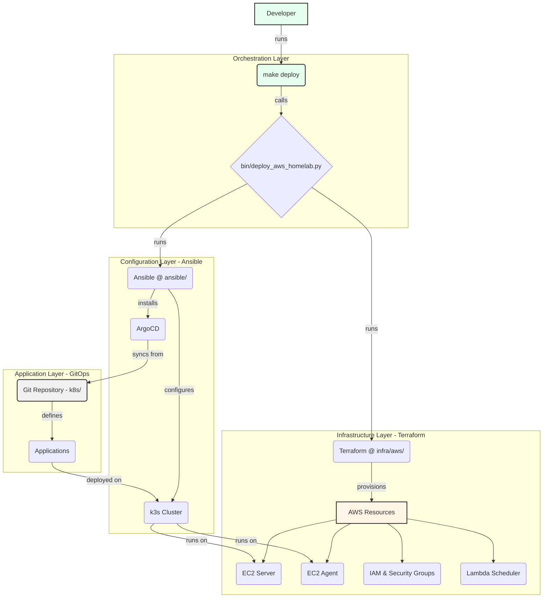

# Homelab Infrastructure

This repository contains the Infrastructure as Code (IaC) for a production-grade, hybrid homelab environment built on AWS, Ansible, and Kubernetes. The entire platform is managed via a GitOps workflow, emphasizing automation, security, and modern DevOps principles.

## 🏗️ Architecture Overview

The platform is designed with a clear separation of concerns, orchestrated by a `Makefile` and a main deployment script.



### Key Technologies
*   **Orchestration:** `Makefile`, Python (`bin/deploy_aws_homelab.py`)
*   **Infrastructure as Code:** **Terraform** (`infra/aws/`)
*   **Configuration Management:** **Ansible** (`ansible/`)
*   **Container Orchestration:** **Kubernetes (k3s)**
*   **Cloud Provider:** **Amazon Web Services (AWS)**
*   **GitOps Controller:** **ArgoCD**
*   **Secrets Management:** **SOPS** with age encryption

## 🚀 Quick Start

> [!TIP]
> For a complete 5-minute deployment guide, see the **[QUICKSTART.md](QUICKSTART.md)**.

1.  **Prerequisites:** Ensure `make`, `terraform`, `ansible`, `aws-cli`, and `kubectl` are installed.
2.  **Configure AWS:** Set up your AWS credentials (`aws configure`).
3.  **Generate SSH Keys:** Create the required SSH keys for AWS and the ArgoCD deploy key.
4.  **Deploy:**
    ```bash
    make deploy
    ```
5.  **Destroy:**
    ```bash
    make destroy
    ```

## 📚 Documentation
This project contains extensive documentation. For a full overview and table of contents, please see the **[Documentation Hub](docs/README.md)**.

| Document | Purpose |
| :--- | :--- |
| **[QUICKSTART.md](QUICKSTART.md)** | **Start Here.** 5-minute guide to get everything running. |
| **[AWS-DEPLOYMENT.md](AWS-DEPLOYMENT.md)** | The complete, in-depth guide to the AWS deployment. |
| **[ansible/README.md](ansible/README.md)** | Detailed documentation for all Ansible roles and playbooks. |
| **[infra/aws/README.md](infra/aws/README.md)** | Deep-dive into the Terraform infrastructure setup. |


## ⚙️ Makefile Usage

A `Makefile` provides a convenient entry point for all common operations.

| Command | Description |
| :--- | :--- |
| `make help` | Displays all available commands. |
| `make deploy` | **Deploys the entire stack from scratch.** |
| `make status` | Shows the current status of the infrastructure. |
| `make destroy` | **Tears down all AWS infrastructure.** |
| `make k8s-nodes` | Lists the current Kubernetes nodes. |
| `make k8s-apps` | Lists the ArgoCD application statuses. |
| `make ansible-deploy` | Runs only the Ansible configuration part. |
| `make terraform-apply` | Runs only the Terraform infrastructure part. |

This project adheres to the conventions and best practices outlined in the main [Architecture Document](docs/architecture.md).
