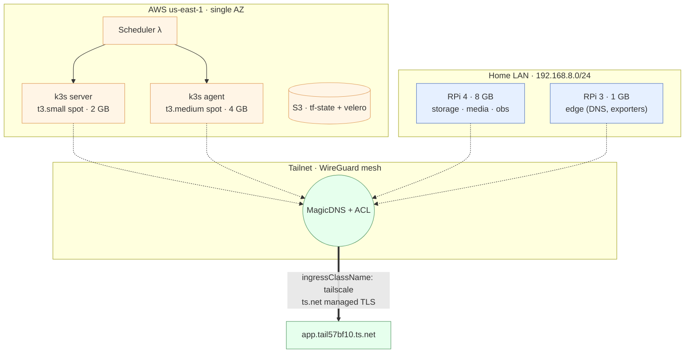

# Homelab

A hybrid k3s cluster spanning AWS EC2 spot instances and Raspberry Pi nodes, reached only over Tailscale, deployed declaratively via Terraform + Ansible + ArgoCD.

> **Documentation:** [`docs/README.md`](docs/README.md) is the single source of truth — start there.

## Architecture

A hybrid k3s cluster whose control plane lives on AWS spot instances and whose storage/media tier lives on Raspberry Pi hardware at home. The two halves are peers on a Tailscale (WireGuard) mesh; there is no public ingress. Provisioning is declarative: Terraform shapes the cloud, Ansible configures every node, ArgoCD reconciles the workload layer, and Kyverno + Falco enforce policy at admission and runtime.



**Resource-allocation rationale:** the AWS pair runs the control plane (uptime independent of the residential uplink); the RPi 4 8 GB carries storage / media / observability (LAN bandwidth + local NVMe latency); the RPi 3 1 GB carries only light edge agents (Tailscale, DNS, node-exporter) — see [`docs/architecture/overview.md`](docs/architecture/overview.md) for the full justification and [`docs/architecture/networking.md`](docs/architecture/networking.md) for the mesh.

| Layer | Tooling |
|---|---|
| Infrastructure | Terraform / OpenTofu (`infra/aws/`) |
| Configuration | Ansible (`ansible/`, 7 roles) |
| Platform | k3s `v1.34.3+k3s1`, ArgoCD `v2.13.2`, Cilium-deferred (Falco eBPF live) |
| Workloads | Kustomize manifests synced by ArgoCD App-of-Apps (`k8s/`) |
| Ingress | Tailscale operator (no public ports anywhere) |
| Admission control | Kyverno ClusterPolicies + Conftest/OPA (CI mirror) |
| Backup | Velero · daily S3 · 14 d retention |
| Secrets | SOPS + age, decrypted by ArgoCD CMP at sync time |

### Security posture

- **Shift-left static analysis** — TruffleHog, Trivy, Checkov, Conftest, kubeconform, ansible-lint enforced on every PR. See [`docs/security/static-analysis.md`](docs/security/static-analysis.md).
- **Supply-chain provenance** — Syft SBOM + Cosign keyless OIDC signing on first-party images; Kyverno verifies signatures at admission. See [`docs/security/supply-chain.md`](docs/security/supply-chain.md).
- **Runtime enforcement** — Kyverno ClusterPolicies (mirroring Conftest) + Falco eBPF runtime detection. See [`docs/security/runtime-enforcement.md`](docs/security/runtime-enforcement.md).

## Quick Start

```bash
make deploy
```

5-minute step-by-step: [`QUICKSTART.md`](QUICKSTART.md). Cost: ~$24.59/month with the default 11 hr/day schedule (~$45.55/month if you disable scheduling). Detail: [`docs/operations/cost-and-scheduling.md`](docs/operations/cost-and-scheduling.md).

## Common Commands

| Command | Purpose |
|---|---|
| `make help` | Every target with its inline description |
| `make deploy` | Full stack from scratch |
| `make destroy` | Tear down AWS infra (interactive confirm) |
| `make ansible-deploy` | Re-run config, skip Terraform |
| `make terraform-apply` | Re-run Terraform, skip Ansible |
| `make smoke-test` | Post-deploy HTTP checks across all 16 apps |
| `make k8s-nodes` / `make k8s-apps` | kubectl shortcuts |

Full reference: [`docs/reference/makefile-targets.md`](docs/reference/makefile-targets.md).

## Documentation

| Path | What |
|---|---|
| [`docs/README.md`](docs/README.md) | Hub — table of contents for everything |
| [`docs/getting-started/`](docs/getting-started/) | Deployment + prerequisites |
| [`docs/architecture/`](docs/architecture/) | AWS, k3s, GitOps, networking, secrets |
| [`docs/operations/`](docs/operations/) | Terraform, Ansible, testing, SOPS, cost |
| [`docs/services/`](docs/services/) | Per-app docs (16 apps) |
| [`docs/runbooks/`](docs/runbooks/) | On-call recovery |
| [`docs/security/`](docs/security/) | Posture, audit history, fixes backlog |
| [`docs/CONVENTIONS.md`](docs/CONVENTIONS.md) | Naming, versioning, doc style |

## Contributing

See [`CONTRIBUTING.md`](CONTRIBUTING.md) for the workflow. Adding an Ansible role? Read [`docs/contributing/ansible-roles.md`](docs/contributing/ansible-roles.md) — every role must have Molecule tests; CI rejects roles without them.
