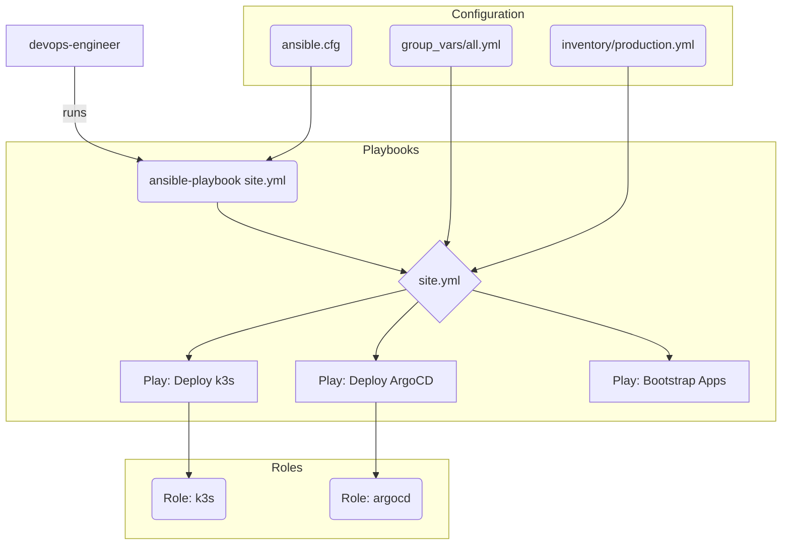

# Ansible Automation for Homelab

This directory contains Ansible roles and playbooks for automating the configuration of the AWS/k3s homelab environment.

## 🚀 Architecture

The Ansible setup is designed to be the primary configuration management tool, executed after Terraform provisions the base infrastructure.

## 📋 Core Components

-   **`playbooks/site.yml`**: The master playbook that orchestrates the entire configuration in three phases: k3s, ArgoCD, and Application Bootstrap.
-   **`roles/`**: Contains reusable Ansible roles for specific technologies.
    -   `k3s`: Installs and configures the k3s server and agent nodes.
    -   `argocd`: Deploys the ArgoCD GitOps controller, configures SOPS, and sets up the Git repository connection.
-   **`inventory/`**:
    -   `terraform_inventory_aws.py`: A **dynamic inventory** script that discovers EC2 instances created by Terraform.
    -   `production.yml`: A static inventory for any on-premise nodes (like Raspberry Pis).
-   **`group_vars/`**: Contains variables for different host groups. `k3s_server.yml` is particularly important as it holds the configuration for ArgoCD and SOPS.

## ⚙️ How It Works

1.  **Dynamic Inventory**: The `terraform_inventory_aws.py` script queries Terraform's state file to find the IPs of the running EC2 instances, making the connection seamless.
2.  **k3s Role**: The `k3s` role uses these IPs to log in and install the Kubernetes control plane and agent services.
3.  **ArgoCD Role**: Once the cluster is up, the `argocd` role deploys ArgoCD into it. It performs several critical functions:
    -   Installs the ArgoCD manifests.
    -   Creates a Kubernetes secret (`sops-age`) containing your age private key, which it reads from your local machine.
    -   Patches the ArgoCD server to load the SOPS plugin and the age key.
    -   Creates another Kubernetes secret (`homelab-repo-secret`) containing the SSH deploy key to allow ArgoCD to access your private GitHub repository.
4.  **Bootstrap Playbook**: Finally, the `bootstrap_apps.yml` playbook applies the main `apps-root.yaml`, telling ArgoCD to take over and deploy all applications from your `k8s/apps` directory.

## Usage

All top-level commands are managed via the root `Makefile`.

| Command | Description |
|:--- |:---|
| `make ansible-deploy` | Runs the main `site.yml` playbook. |
| `make ansible-check` | Performs a dry run of the playbook. |
| `make ansible-ping` | Tests SSH connectivity to all hosts discovered by the inventory. |
