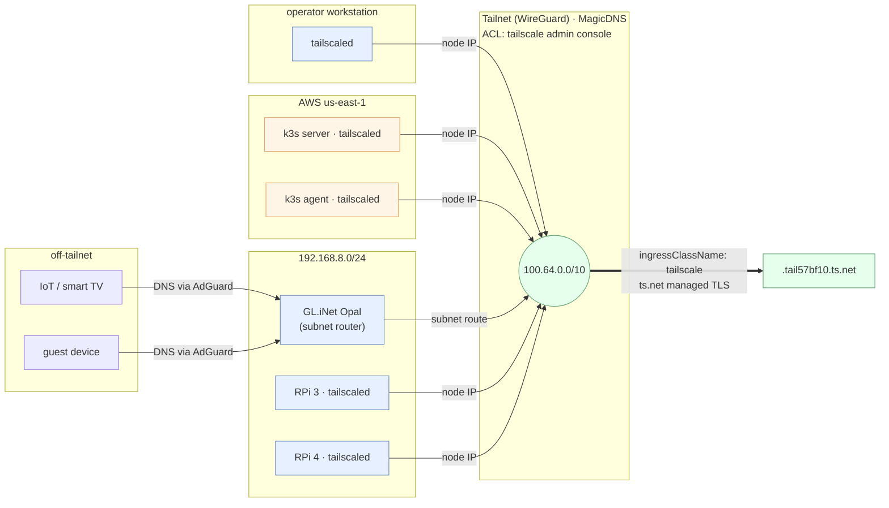
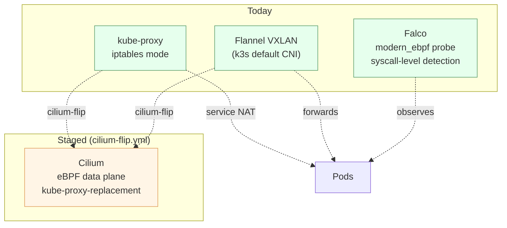

# Networking

> **Status:** Active
> **Last reviewed:** 2026-05-12
> **Owner:** @ariel-extending851

Two design invariants frame every networking decision in this repo:

1. **No public TCP port exists on any node.** Operator and inter-cluster traffic ride the Tailscale mesh; nothing else is reachable from the open internet.
2. **The data plane is replaceable, not load-bearing.** The current CNI (Flannel) is k3s's default. Runtime security observability is provided by Falco's eBPF probe today, and the CNI itself is staged for migration to Cilium (see [§5](#5-ebpf-stack-current-and-staged)) when bootstrap risk is acceptable.

> See also: [LAN ↔ tailnet bridge](lan-tailnet-bridge.md) — how off-tailnet LAN clients (smart TVs, IoT, guest devices) reach `*.tail57bf10.ts.net` services through AdGuard split DNS plus the GL.iNet reverse route.

---

## 1. Address Plan

| CIDR | Purpose | Source |
|---|---|---|
| `192.168.8.0/24` | Home admin LAN (trusted) | `ansible/group_vars/all.yml` |
| `192.168.9.0/24` | Home guest/IoT LAN (isolated) | `ansible/group_vars/all.yml` |
| `192.168.8.1` | Opal gateway (OpenWrt, GL.iNet) | `ansible/group_vars/all.yml` |
| `100.64.0.0/10` | Tailscale CGNAT range; per-node IPs | Tailscale console |
| `tail57bf10.ts.net` | MagicDNS suffix for the tailnet | Tailscale console |
| `10.42.0.0/16` | k3s **pod** CIDR (Flannel VXLAN) | `ansible/group_vars/all.yml` |
| `10.43.0.0/16` | k3s **service** CIDR (ClusterIP) | `ansible/group_vars/all.yml` |
| `cluster.local` | k3s cluster DNS suffix | `ansible/group_vars/all.yml` |

---

## 2. Tailscale Mesh

Every node — AWS EC2 and Raspberry Pi alike — runs the `tailscaled` daemon (provisioned by the Ansible `tailscale` role) and joins the tailnet using an auth key delivered through SOPS. WireGuard handles encryption; the Tailscale admin console holds the ACL.

### 2.1 Architectural justification for Tailscale

!!! abstract "Decision: Tailscale as the only ingress path"
    Tailscale was selected over a self-hosted WireGuard mesh, NetBird, or a public load-balancer-plus-WAF stack because it collapses three concerns into one substrate:

    - **Zero public attack surface.** The AWS security group has no `0.0.0.0/0` rule; the home router has no port-forward. The k3s API server has no public IP. The only ingress paths are the tailnet (operator + apps) and AWS SSM (break-glass), both audited.
    - **Operator-managed Kubernetes ingress.** The Tailscale operator publishes `ingressClassName: tailscale` and a `ProxyClass` CRD; any `Ingress` becomes a dedicated proxy pod with a tailnet hostname and `ts.net` managed TLS. No external load balancer, no Cloudflare tunnel, no DNS-01 cert dance.
    - **Defense-in-depth ACL.** Tailscale ACLs gate which tailnet identities can reach which tagged services, independent of cluster RBAC. A compromised laptop with tailnet membership still cannot reach internal admin endpoints unless its tag allows it.

    Trade-off accepted: the tailnet control plane is a hosted dependency. The break-glass path is AWS SSM (IAM-authenticated, CloudTrail-audited), which the runbooks [`tailscale-logged-out.md`](../runbooks/tailscale-logged-out.md) and [`control-plane-recovery.md`](../runbooks/control-plane-recovery.md) exercise.

### 2.2 Operational notes

- Auth keys are reusable + ephemeral; rotated on the cadence in [`../runbooks/sops-key-rotation.md`](../runbooks/sops-key-rotation.md).
- Stale tailnet nodes are pruned by `make clean-tailscale` (Ansible playbook calling the Tailscale API).
- Recovery when a node's session drops: [`../runbooks/tailscale-logged-out.md`](../runbooks/tailscale-logged-out.md).

---

## 3. Cluster Ingress: Tailscale Operator

The in-cluster [Tailscale Kubernetes operator](../../k8s/system/tailscale-operator) publishes an `IngressClass` named `tailscale`. An `Ingress` resource using that class receives:

- A dedicated proxy pod (`ts-<name>` in the `tailscale` namespace).
- A tailnet hostname matching the Ingress `host`.
- Automatic TLS via Tailscale's managed certificate program.
- No external load balancer, no port forwarding.

Active ingress hostnames: [`../reference/tailnet-services.md`](../reference/tailnet-services.md).

### 3.1 ProxyClass shaping

The operator's `ProxyClass` CRD lets each service tune its proxy's resources and node placement. Current classes:

| ProxyClass | Used by | Purpose |
|---|---|---|
| `default` | most apps | Standard bandwidth, single replica |
| `high-bandwidth` | `grafana` | Larger CPU/mem requests for dashboard and log streaming |

To opt in, annotate the `Service`: `tailscale.com/proxy-class: high-bandwidth`. The ProxyClass also carries a `nodeSelector` that spreads proxy pods to avoid stacking memory pressure on the 2 GB k3s server — see [`docs/architecture/overview.md#2-resource-allocation-rationale`](overview.md#2-resource-allocation-rationale).

---

## 4. Data Plane

Today the cluster runs k3s's bundled **Flannel** CNI in VXLAN mode (pod CIDR `10.42.0.0/16`). Pod-to-pod traffic between Raspberry Pi nodes and AWS workers is encapsulated and rides the tailnet WireGuard tunnel as outer transport. Service IPs (`10.43.0.0/16`) are programmed by kube-proxy in iptables mode.

This is intentional: the data plane is the most disruptive thing to change on a single-control-plane cluster, and the bootstrap order matters (see [§5](#5-ebpf-stack-current-and-staged)).

---

## 5. eBPF Stack (Current and Staged)

The cluster's eBPF footprint is split across two layers: **runtime observability (Falco) is live today; data-plane (Cilium) is staged for a future migration.**

### 5.1 Falco (live)

Falco runs as a DaemonSet ([`k8s/apps/falco/`](../../k8s/apps/falco/)) with the `modern_ebpf` probe kind. It attaches to syscall-tracing eBPF programs to detect runtime threats — unexpected exec into containers, writes outside the rootfs, privilege escalation attempts — and emits findings to the otel-collector pipeline. This is the runtime arm of the security stack; admission-time enforcement lives in Kyverno (see [`../security/runtime-enforcement.md`](../security/runtime-enforcement.md)).

### 5.2 Cilium (staged, not active)

The repo carries pre-pull and flip playbooks ([`ansible/playbooks/cilium-prepull.yml`](../../ansible/playbooks/cilium-prepull.yml), [`ansible/playbooks/cilium-flip.yml`](../../ansible/playbooks/cilium-flip.yml)) for migrating the data plane to Cilium with kube-proxy-replacement. The default remains off (`enable_cilium_cni: false` in [`ansible/roles/k3s/defaults/main.yml`](../../ansible/roles/k3s/defaults/main.yml)) for two reasons:

- **Bootstrap risk.** A CNI swap during initial cluster formation has produced unrecoverable clusters in practice; the comment block in [`k8s/apps/kustomization.yaml`](../../k8s/apps/kustomization.yaml) records the failure mode.
- **Memory ceiling.** Cilium's agent footprint must be measured against the 2 GB k3s server budget before commitment; the prepull playbook exists to time and size this on a steady-state cluster.

The migration is gated by an observability and resource-budget review; until then, Flannel remains the data plane and Falco delivers the eBPF visibility that is most valuable today (security telemetry, not packet forwarding).

---

## 6. NetworkPolicies

Most app namespaces are open by default. The enforced policies live in [`k8s/system/network-policies/monitoring-policies.yaml`](../../k8s/system/network-policies/monitoring-policies.yaml):

- **Allow Prometheus scrape** from the `monitoring` namespace into every app namespace's metrics port.
- **Default-deny** egress on the `monitoring` namespace except DNS, intra-cluster scrape targets, and Loki.

Full rationale and the NetworkPolicy authoring conventions: [`../security/network-policies.md`](../security/network-policies.md).

---

## 7. Operator Access Paths

There are exactly two ways to reach a node:

1. **Tailscale (preferred).** `ssh <user>@<node>.tail57bf10.ts.net` — works identically for AWS instances and Raspberry Pis.
2. **AWS SSM Session Manager (break-glass).** `aws ssm start-session --target <instance-id>` — IAM-authenticated, CloudTrail-audited; used when a node has joined AWS but not yet joined the tailnet (initial bootstrap or after a failed Tailscale auth).

!!! warning "There is no inbound SSH from the public internet."
    The security group provisioned by [`infra/aws/modules/network`](../../infra/aws/modules/network) has no `0.0.0.0/0` ingress rule. If you find one, that is a regression — open an audit-history entry and revert.

---

## 8. Where to Go Next

- **Tailscale operator catalog page:** [`../services/tailscale-operator.md`](../services/tailscale-operator.md)
- **Recovery when tailnet auth fails:** [`../runbooks/tailscale-logged-out.md`](../runbooks/tailscale-logged-out.md)
- **Per-app ingress hostnames:** [`../reference/tailnet-services.md`](../reference/tailnet-services.md)
- **AWS security group rules:** [`aws-infrastructure.md`](aws-infrastructure.md)
- **Runtime admission and runtime detection layers:** [`../security/runtime-enforcement.md`](../security/runtime-enforcement.md)
