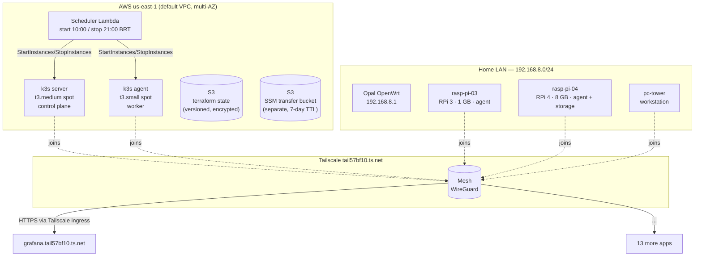

# Architecture Overview

> **Status:** Active
> **Last reviewed:** 2026-04-23
> **Owner:** @ariel-extending851

A hybrid k3s cluster spanning AWS EC2 spot instances and Raspberry Pi nodes, reached only over Tailscale, deployed declaratively via Terraform + Ansible + ArgoCD.

---

## High-Level Topology

---

## Layer Cake

| Layer | Tooling | Source of truth |
|---|---|---|
| **Infrastructure** | Terraform (modules: `network`, `compute`, `scheduler`) | [`infra/aws/`](../../infra/aws/) |
| **Configuration** | Ansible (roles: `k3s`, `tailscale`, `argocd`, `gatekeeper`, `rpi_optimization`, `emergency_recovery`) | [`ansible/`](../../ansible/) |
| **Platform** | k3s `v1.34.3+k3s1`, ArgoCD `v2.13.2` | [`ansible/group_vars/all.yml`](../../ansible/group_vars/all.yml) |
| **Applications** | Kustomize manifests synced by ArgoCD (App-of-Apps) | [`k8s/apps/`](../../k8s/apps/), [`k8s/gitops/apps-root.yaml`](../../k8s/gitops/apps-root.yaml) |
| **Ingress** | Tailscale operator (`ingressClassName: tailscale`) | [`k8s/system/tailscale-operator/`](../../k8s/system/tailscale-operator/) |
| **Secrets** | SOPS + age encryption, decoded by ArgoCD CMP | [`.sops.yaml`](../../.sops.yaml), [`secrets-management.md`](secrets-management.md) |

---

## Network Topology

| CIDR | Purpose | Source |
|---|---|---|
| `192.168.8.0/24` | Home admin LAN (trusted) | `ansible/group_vars/all.yml` |
| `192.168.9.0/24` | Home guest/IoT LAN (isolated) | `ansible/group_vars/all.yml` |
| `100.64.0.0/10` | Tailscale CGNAT range (assigned per-node) | Tailscale |
| `10.42.0.0/16` | k3s pod CIDR | `ansible/group_vars/all.yml` |
| `10.43.0.0/16` | k3s service CIDR | `ansible/group_vars/all.yml` |

**No public ingress to AWS instances.** The k3s security group allows only intra-cluster traffic (self-referencing). All operator access goes via Tailscale (WireGuard) or AWS SSM Session Manager (IAM-authenticated). Details: [`networking.md`](networking.md).

---

## Node Inventory

| Hostname | Role | Hardware | Lives in | Notes |
|---|---|---|---|---|
| k3s-server (dynamic) | Control plane | EC2 t3.medium spot | AWS us-east-1 | Provisioned by `infra/aws/`; joins tailnet via auth key |
| k3s-agent (dynamic) | Worker | EC2 t3.small spot | AWS us-east-1 | Same lifecycle as server |
| rasp-pi-03 | Worker, low-memory | RPi 3 · 4 cores · 1 GB | Home LAN | AdGuard (LAN DNS), monitoring sidecars |

The AWS pair runs only between **10:00 and 21:00 America/Sao_Paulo** by default (scheduler Lambda). RPi nodes are always on. Cost detail: [`../operations/cost-and-scheduling.md`](../operations/cost-and-scheduling.md).

---

## Request Flow Example

A user opening `https://grafana.tail57bf10.ts.net` from their laptop:

1. Laptop is on the tailnet (joined via Tailscale client)
2. MagicDNS resolves the hostname to the Tailscale operator's proxy pod
3. Tailscale operator terminates TLS (managed cert) and forwards to the in-cluster `Service`
4. `Service` routes to the Grafana pod (any node satisfying nodeSelector)
5. Grafana queries Prometheus / Loki via in-cluster ClusterIP services

No public DNS, no public load balancer, no port-forwarding.

---

## Where to Go Next

- **First time deploying:** [`../getting-started/deployment.md`](../getting-started/deployment.md)
- **AWS deep-dive:** [`aws-infrastructure.md`](aws-infrastructure.md)
- **GitOps / ArgoCD:** [`gitops.md`](gitops.md)
- **A specific app:** [`../services/README.md`](../services/README.md)
