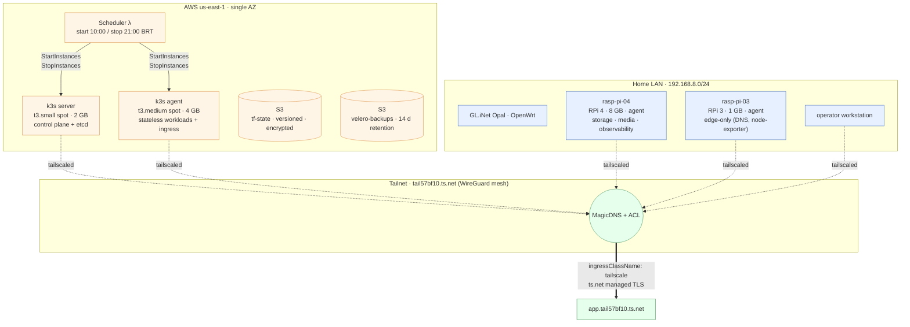

# Architecture Overview

> **Status:** Active
> **Last reviewed:** 2026-05-12
> **Owner:** @ariel-extending851

A hybrid k3s cluster spanning AWS EC2 spot instances and Raspberry Pi nodes. Operator access and inter-node traffic ride a Tailscale mesh; there is no public ingress. Provisioning is declarative: Terraform shapes the cloud, Ansible configures every node, ArgoCD reconciles the workload layer.

This document captures **architectural justification** — the constraints that shaped the design and the trade-offs explicitly accepted. Mechanics (commands, file paths, version strings) live in the linked sub-docs.

---

## 1. Topology

The k3s control plane lives in AWS. Worker nodes span both AWS and the home LAN; from the cluster's perspective they are peers on the same Layer-3 mesh. Source code references: [`infra/aws/`](../../infra/aws/), [`ansible/inventory/production.yml`](../../ansible/inventory/production.yml).

---

## 2. Resource Allocation Rationale

The placement decision for each node class is driven by the workload's tolerance for a single failure mode: **the cloud and the LAN have inverted reliability profiles.**

| Tier | Hardware | Workload class | Primary justification |
|---|---|---|---|
| **Control plane** | AWS `t3.small` spot (2 GB) | k3s server, etcd, ArgoCD application controller | Symmetric cloud uptime (no residential ISP dependency on the API server); reachable over SSM for break-glass even when the tailnet is down. The 2 GB ceiling drives the cluster's memory budget — see [`operations/resource-limits.md`](../operations/resource-limits.md). |
| **Cloud workers** | AWS `t3.medium` spot (4 GB) | Stateless apps, ingress controllers, log aggregation buffer | Burstable CPU credits absorb ArgoCD reconciliation spikes; egress through AWS NAT is cheaper and lower-latency than the residential upload pipe. |
| **Storage / media tier** | RPi 4 · 8 GB | Longhorn replicas, media services, otel-collector | Local NVMe over USB 3.0 delivers single-digit-ms PVC latency that no t3-class EBS volume sustains under spot interruption; 8 GB headroom absorbs Prometheus scrape buffers without evicting pods. |
| **Light edge tier** | RPi 3 · 1 GB | Tailscale subnet router, node-exporter, AdGuard DNS | The 1 GB ceiling forbids anything stateful; this node is tainted and selector-pinned to repel pods that the kubelet would later evict under memory pressure. See [`runbooks/rpi-oom-mitigation.md`](../runbooks/rpi-oom-mitigation.md). |

!!! abstract "Decision: AWS for control plane, RPi for storage and media"
    The control plane runs on AWS because the API server's availability budget must not depend on a residential uplink; the storage and media tiers run on Raspberry Pi because their hot path is LAN bandwidth and local-disk latency, both of which a cloud worker would *worsen*, not improve. The result is a cluster whose two most expensive failure modes — control-plane unreachability and storage I/O degradation — are pushed onto independent infrastructure substrates.

---

## 3. Layer Cake

| Layer | Tooling | Source of truth |
|---|---|---|
| **Infrastructure** | OpenTofu / Terraform — modules `network`, `compute`, `scheduler`, `audit` | [`infra/aws/`](../../infra/aws/) |
| **Configuration** | Ansible — roles `k3s`, `tailscale`, `argocd`, `tailscale_operator`, `rpi_optimization`, `gatekeeper`, `emergency_recovery` | [`ansible/`](../../ansible/) |
| **Platform** | k3s `v1.34.3+k3s1`, ArgoCD `v2.13.2`, Cilium-deferred (see [`networking.md`](networking.md)) | [`ansible/group_vars/all.yml`](../../ansible/group_vars/all.yml) |
| **Admission control** | Kyverno ClusterPolicies (runtime) + Conftest/OPA (CI) | [`k8s/system/kyverno/policies/`](../../k8s/system/kyverno/policies/), [`k8s/policies/`](../../k8s/policies/) |
| **Workloads** | Kustomize manifests reconciled by ArgoCD App-of-Apps | [`k8s/apps/`](../../k8s/apps/), [`k8s/gitops/apps-root.yaml`](../../k8s/gitops/apps-root.yaml) |
| **Ingress** | Tailscale operator (`ingressClassName: tailscale`) — no public load balancer | [`k8s/system/tailscale-operator/`](../../k8s/system/tailscale-operator/) |
| **Secrets** | SOPS + age, decrypted by ArgoCD CMP at sync time | [`.sops.yaml`](../../.sops.yaml), [`secrets-management.md`](secrets-management.md) |
| **Backup** | Velero · daily S3 schedule · 14 d retention | [`k8s/apps/velero/`](../../k8s/apps/velero/), [`runbooks/disaster-recovery-velero.md`](../runbooks/disaster-recovery-velero.md) |

---

## 4. Network Topology

| CIDR | Purpose | Source |
|---|---|---|
| `192.168.8.0/24` | Home admin LAN (trusted) | `ansible/group_vars/all.yml` |
| `192.168.9.0/24` | Home guest/IoT LAN (isolated) | `ansible/group_vars/all.yml` |
| `100.64.0.0/10` | Tailscale CGNAT (per-node IPs assigned by tailnet) | Tailscale control plane |
| `10.42.0.0/16` | k3s pod CIDR (Flannel VXLAN today; see [`networking.md`](networking.md)) | `ansible/group_vars/all.yml` |
| `10.43.0.0/16` | k3s service CIDR | `ansible/group_vars/all.yml` |

The AWS security group has no `0.0.0.0/0` rule. Operator access is **Tailscale-or-SSM-only**, both audited (`tailscaled` connection log, CloudTrail). Detail: [`networking.md`](networking.md).

---

## 5. Constraints That Shaped the Design

These are hard limits enforced by the chosen substrate, not preferences:

- **2 GB memory ceiling on the k3s server.** Every system DaemonSet's resource request is sized against this. Workloads >256 Mi request must justify themselves in the [resource limits doc](../operations/resource-limits.md).
- **Single AZ.** Multi-AZ doubles NAT-gateway cost without buying the cluster anything a fresh `make deploy` cannot provide in ~12 min. Trade-off analysis: [`single-az-tradeoff.md`](single-az-tradeoff.md).
- **Residential NAT on the LAN side.** RPi nodes cannot accept inbound TCP from the internet; the tailnet overlay is the only ingress path for them.
- **Spot interruption window.** AWS may reclaim either EC2 in seconds. Stateful workloads on AWS nodes are forbidden by policy — they live on RPi 4 or not at all.
- **One operator.** All runbooks, all rotations, all on-call. Operational complexity that cannot survive a single person is rejected.

---

## 6. Trade-offs Explicitly Rejected

!!! abstract "Decisions: deferred or declined"
    These were considered and ruled out. Each may be revisited; the rationale is captured here so future-me does not re-litigate the same ground.

- **Multi-AZ.** Adds NAT-gateway hours + cross-AZ data charges that exceed the value of the second AZ for a cluster this size. Re-deploy is the DR plan.
- **Cilium as today's CNI.** Replacing Flannel during bootstrap on a 2 GB control plane risks an unrecoverable cluster; the [`cilium-flip.yml`](../../ansible/playbooks/cilium-flip.yml) playbook stages the migration for after observability is steady. eBPF runtime visibility is provided in the meantime by Falco — see [`networking.md`](networking.md).
- **External Secrets Operator.** SOPS-CMP decrypts at ArgoCD sync time; one secret store fewer to operate. ESO would add a runtime dependency that buys nothing for a single-operator cluster.
- **HashiCorp Vault.** Same calculus, larger footprint. Reconsider when secret-issuance becomes dynamic (e.g., per-pod DB credentials).
- **NetBird as an alternative mesh.** Self-hosting a coordination server adds an operational surface that the current tailnet (managed control plane + ACLs in the admin console) does not require. Tailscale's `ingressClassName: tailscale` operator integration is the deciding factor.

---

## 7. Request Flow Example

A user opening `https://grafana.tail57bf10.ts.net` from their laptop:

1. The laptop is on the tailnet (Tailscale client running locally).
2. **MagicDNS** resolves `grafana.tail57bf10.ts.net` to the Grafana proxy pod inside the cluster.
3. The Tailscale operator's proxy terminates `ts.net` managed TLS and forwards to the in-cluster `Service`.
4. The `Service` (ClusterIP `10.43.x.x`) routes to a Grafana pod on whichever node satisfies its `nodeAffinity` — typically `rasp-pi-04` for proximity to Loki PVCs.
5. Grafana queries Prometheus and Loki over in-cluster ClusterIP services. No traffic leaves the cluster.

No public DNS record, no public load balancer, no port-forwarding rule on the home router.

---

## 8. Where to Go Next

- **Mesh + ingress detail:** [`networking.md`](networking.md)
- **AWS-side IAM, EC2, Lambda:** [`aws-infrastructure.md`](aws-infrastructure.md)
- **GitOps / ArgoCD App-of-Apps:** [`gitops.md`](gitops.md)
- **Secrets architecture:** [`secrets-management.md`](secrets-management.md)
- **Single-AZ trade-off paper:** [`single-az-tradeoff.md`](single-az-tradeoff.md)
- **Security posture:** [`../security/overview.md`](../security/overview.md)
- **First-time deployment:** [`../getting-started/deployment.md`](../getting-started/deployment.md)
