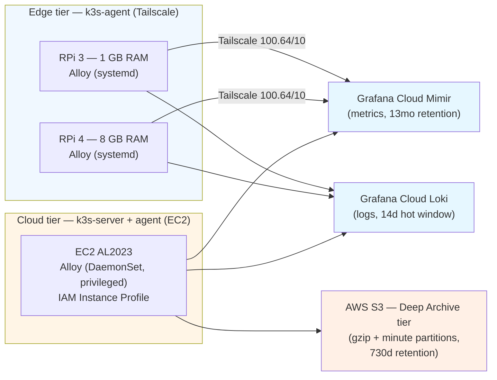

# Unified Grafana Alloy + eBPF Observability Pipeline

> **Status:** Active — cloud tier as originally designed; edge tier iterated to Promtail after production validation (see § Edge tier iteration).
> **Repository:** This document is the portfolio-facing README for the Alloy + eBPF observability pipeline. It is derived from the engineering ADR at [`./observability-alloy-ebpf.md`](./observability-alloy-ebpf.md) and is intended to be copied verbatim into the public portfolio repository alongside a sanitized excerpt of the configuration.

This pipeline collapses three independent telemetry agents
(Prometheus / Loki / OTel Collector) into a **single Grafana Alloy binary**,
extends it with **kernel-level eBPF instrumentation via Grafana Beyla**, and
fans the output to **three independent sinks**: Grafana Cloud (metrics +
logs) and AWS S3 (compressed cold storage).

The same agent runs in two very different envelopes:

1. **Edge tier** — Raspberry Pi 3 / 4 acting as `k3s-agent` nodes, joined over Tailscale to an AWS-hosted control plane. Resource-constrained: the Pi 3 has 1 GB of RAM total.
2. **Cloud tier** — AWS EC2 spot instances (Amazon Linux 2023, kernel ≥ 6.1) running the k3s server and a stateless worker.

---

## Architecture



The edge tier writes only to Grafana Cloud — Raspberry Pis hold no AWS
credentials. The S3 cold-storage path is reserved for the EC2 Alloy,
which authenticates via the IAM Instance Profile attached to the
launch template. No access keys are stored in any manifest, env file, or
container image.

---

## Why Grafana Alloy, and not three separate agents?

Running Prometheus + Loki + OTel Collector side-by-side on a 1 GB Raspberry
Pi wastes resources on three supervised processes, three sets of
configuration, three update cadences. Alloy collapses them into one binary
with a single configuration language (River) and one process surface to
monitor.

Concrete savings observed on the Pi 4 during canary:
- ~110 MiB RSS for the DaemonSet path vs ~40 MiB for the native systemd path on the same node — the **edge tier intentionally chooses native systemd** for the same reason.
- One systemd unit to log-tail, one WAL to disk-budget, one binary to checksum-verify on install.

---

## Why Beyla (user-space eBPF), and not Cilium Hubble (kernel CNI)?

The brief is "kernel-level eBPF telemetry, zero application instrumentation".
Two paths satisfy that:

1. **Cilium Hubble** — Cilium replaces the cluster CNI, and Hubble surfaces
   flow / HTTP / DNS telemetry from the data-plane eBPF programs.
2. **Grafana Beyla** — runs as a user-space binary, attaches uprobes and
   tracepoints on its own, emits RED metrics (Rate / Errors / Duration) +
   service-graph spans, no CNI changes.

**This homelab evaluated Cilium and deferred it** (see
[`../../ansible/playbooks/cilium-flip.yml`](../../ansible/playbooks/cilium-flip.yml)
and [`./networking.md`](./networking.md)). Replacing Flannel with Cilium
during cluster bootstrap on a 2 GB control plane risks an unrecoverable
state: kubectl + SSM both time out, and the only recovery is full
re-deploy. The flip is staged for a quieter window, independent of this
observability work.

Beyla wins on **what we can ship today**:

| Property                          | Beyla                       | Cilium Hubble              |
| --------------------------------- | --------------------------- | -------------------------- |
| CNI swap required                 | No                          | Yes (and risky on a 2 GB control plane) |
| Kernel minimum                    | 5.4 (Pi-friendly)           | 5.10+ for full feature set |
| HTTP / gRPC RED metrics           | Yes, app-level              | Yes, via flow inspection   |
| Service-graph spans               | Yes, OTLP-native            | Yes, via Hubble UI         |
| Runs on Raspberry Pi OS Bookworm  | Yes                         | Yes, but requires CNI flip |
| Resource cost on RPi 3            | ~40 MiB (capped at 300 MiB) | Significant — Cilium agent alone is 200+ MiB |

Beyla is the right tool for **edge observability**. Cilium remains the
right tool for **cluster data-plane observability** — and the two
decisions are independent.

---

## Compliance — workload labeling taxonomy

The Raspberry Pis run containerized workloads that, by deliberate policy,
must never be referred to by product name in any published telemetry,
configuration, or documentation. The approved taxonomy is:

| `service_class` value              | Used for                                                                  |
| ---------------------------------- | ------------------------------------------------------------------------- |
| `containerized_microservice`       | Generic stateless service in a container                                  |
| `media_streaming_daemon`           | Workload whose primary I/O is bulk media or content streaming             |
| `high_throughput_local_service`    | LAN-facing data plane with sustained high request rate                    |

Three independent enforcement layers:

1. **Source** — `discovery.relabel` promotes the `homelab.io/class`
   annotation, then `labeldrop` removes pod / container names so they
   cannot reach the sink.
2. **Sink** — `prometheus.relabel.cardinality_guard` and
   `loki.process.normalize` defensive drop-regex catches any label that
   leaked the source rule.
3. **Repo** — a pytest contract test (`bin/tests/contracts/`) scans
   `k8s/apps/alloy/`, `ansible/roles/alloy/`, and Alloy-touching docs at
   commit time and fails CI on any forbidden product name outside an
   explicit drop-regex declaration.

---

## S3 cold-storage design

The OTel `awss3` exporter receives the same log stream as the Grafana
Cloud Loki sink. Logs are batched 5 minutes / 5 MiB, gzip-compressed,
serialized as OTLP-proto, and uploaded under a `minute`-grain prefix
(`alloy/year=2026/month=05/day=23/hour=22/minute=10/logs-...`).

The bucket configuration is:

- **Naming:** `hl-observability-cold-storage-<random-suffix>` (Terraform `bucket_prefix`).
- **Encryption:** SSE-S3 (`AES256`). KMS rejected on cost grounds; the bucket policy denies any PUT without the SSE header.
- **Public access:** all four block-public flags `true`.
- **Versioning:** enabled — defends against an Alloy bug or operator error overwriting an in-progress upload.
- **Lifecycle:** Standard → Standard-IA at 30 days → Deep Archive at 90 days → expire at 730 days.
- **Multipart hygiene:** incomplete uploads abort at 7 days (prevents leaked storage charges from a daemon crash mid-upload).
- **TLS-only:** bucket policy denies any request with `aws:SecureTransport == false`.
- **Force-destroy:** disabled — archived logs are evidentiary.
- **Force-destroy is also disabled in IAM:** the `k3s_node` role has `s3:PutObject` / `s3:AbortMultipartUpload` only. No `GetObject`, no `DeleteObject`. Cold reads happen out-of-band with a separate read-only IAM principal (future work).

---

## Trade-offs table

| Trade-off                       | Cost                                                          | Mitigation                                                                                                                |
| ------------------------------- | ------------------------------------------------------------- | ------------------------------------------------------------------------------------------------------------------------- |
| RPi 3 RAM budget                | Alloy uses ~40 MiB; Beyla adds ~80 MiB                        | `MemoryMax=300M`; Beyla optional per host; preflight refuses install below 128 MiB free                                   |
| `hostPID` + `CAP_SYS_ADMIN` on the cluster DaemonSet | UID 0 with the explicit Beyla cap set (NOT `privileged: true`) | Mirrors the Falco DaemonSet exactly — `privileged: false`, `allowPrivilegeEscalation: false`, `capabilities.drop: [ALL]` + explicit adds. Kyverno PolicyException scoped to ns `alloy` only; NetworkPolicy denies all egress except DNS / kube-apiserver / Grafana Cloud / S3 / IMDSv2 |
| Grafana Cloud free-tier 10k cap | Cardinality drift causes ingest 429s                          | `prometheus.relabel.cardinality_guard` drops cAdvisor `id` / `name`; per-label drop rules in the runbook; alert at 9 k    |
| S3 PUT API cost (~$0.005 / 1k)  | 12 puts / hour / node ≈ 8.6 k / month → ≈ $0.04 / month / node | Acceptable; 5-min batching is the throttle                                                                                |
| IAM hop-limit raised 1 → 2      | Slightly larger SSRF surface                                  | 2 is AWS's recommended pod-IMDSv2 ceiling; tested to block from-host SSRF                                                  |
| Cilium evaluation deferred      | Cluster-flow visibility limited to Beyla's RED metrics        | Future PR — independent of this work; flip risk on 2 GB control plane is documented                                       |

---

## Verify locally

```bash
# Static validation (these run in CI on every PR)
pre-commit run --all-files
make validate-terraform-all                    # fmt + validate + tflint + .tftest.hcl
make validate-k8s-all                          # kustomize build + kubeconform
make validate-k8s-policies-critical            # OPA / conftest
make test-molecule-alloy                       # role unit tests
make test-python                               # contract test (no forbidden names)

# Plan the Terraform diff (S3 bucket + IAM policy + hop-limit bump)
mise exec -- terraform -chdir=infra/aws plan

# Dry-run the edge role
mise exec -- ansible-playbook \
  -i ansible/inventory/production.yml \
  ansible/playbooks/deploy-alloy.yml \
  --tags alloy --check --diff
```

After deploy:

```bash
# Post-deploy smoke — edge
ansible -i ansible/inventory/production.yml alloy_native \
  -m shell -a 'systemctl status alloy --no-pager; \
               journalctl -u alloy -n 50 --no-pager'

# Post-deploy smoke — cloud
kubectl -n alloy rollout status ds/alloy
kubectl -n alloy logs -l app=alloy --tail=200

# S3 archival (5-min batches + flush — expect objects within ~6 min)
aws s3 ls "s3://$(mise exec -- terraform -chdir=infra/aws output -raw observability_bucket_id)/alloy/" --recursive | head

# Grafana Cloud Explore
#   Metrics:        up{cluster="homelab"}
#   Beyla RED:      http_server_request_duration_seconds_count{cluster="homelab", service_class="media_streaming_daemon"}
#   Logs:           {cluster="homelab"} |= ""
```

---

## Roadmap

1. **Follow-up PR — retire in-cluster Prometheus / Loki / OTel.** Now that
   Alloy carries the full telemetry surface to Grafana Cloud, the
   in-cluster stack (`k8s/apps/prometheus`, `loki`, `otel-collector`,
   `node-exporter`, `kube-state-metrics`) becomes redundant. Wait for 14
   days of stable Alloy operation (matches GC Loki retention), then
   delete in one focused PR.
2. **Independent Cilium flip.** Per `ansible/playbooks/cilium-flip.yml`.
   Independent of this work.
3. **Read-only S3 role for cold-read access.** A separate IAM principal
   with `s3:GetObject` only, used by an out-of-band cold-tier query tool.
   Keeps the agent role write-only.
4. **Profiling pipeline.** Pyroscope (also part of the Grafana stack)
   on the same Alloy binary, gated on RPi 3 memory headroom.

---

## Edge tier iteration (2026-05-29)

The original design placed a single Alloy template on both tiers — Ansible
rendered it onto the Pis as a systemd unit, Kustomize rendered it onto the
EC2 worker as a DaemonSet. Cloud tier worked as planned. **Edge tier
revealed a real-world contention that the design did not predict:**
co-locating Alloy with Jellyfin transcoding on the 8 GB Pi 4 degraded
playback. Disabling Alloy restored it; the symptom was reproducible.

### What I learned

The bottleneck was not Alloy's resident set size. It was the *kind* of work
Alloy does on an edge node that also serves the apiserver:

1. `discovery.kubernetes` polls the apiserver continuously to maintain pod
   targets. On the Pi 4 the apiserver IS the k3s-server process — so the
   discovery loop competed for CPU with k3s itself.
2. Jellyfin transcoding is I/O heavy on the same SD-card-backed root
   filesystem the k3s log endpoints serve from. Every Alloy → apiserver →
   pod log round-trip added I/O queue pressure that the SD card could not
   absorb under transcoding load.

Memory headroom was never the issue (Pi 4 had ~3 GB free). The interaction
between the discovery model and the apiserver-on-edge topology was.

### What I changed

The edge tier now runs **Promtail with file-based discovery**
(`static_configs` + `__path__` glob) instead of Alloy. Promtail reads container
log files directly via inotify, never calls the apiserver, and idles around
25–40 MiB RSS. The invariant is enforced at the network layer too: the
Promtail NetworkPolicy blocks egress to port 6443.

The cloud tier — section 1 through "Implementation" above — is unchanged.
Alloy + Beyla + the S3 cold archive still run as designed when AWS Full is
active. Promtail's `nodeAffinity NotIn ["cloud"]` and Alloy's existing
`nodeSelector: tier=cloud` keep the two off each other's nodes. No
double-ingest.

### Why this matters for a portfolio

The original ADR captured my reasoning *before* operating the system. The
revision section in [`./observability-alloy-ebpf.md`](./observability-alloy-ebpf.md)
captures what I learned *after*. Both stay in the repo. The lesson — *prefer
file-based discovery on any node that also runs the apiserver* — is now an
explicit design rule. If you are reviewing this for a role, the iteration is
the artifact I want you to read: production validation found a defect the
design missed, and the response was a surgical pivot with the cloud-side
investment preserved.

---

## References

- **Architecture ADR (long-form):** [`./observability-alloy-ebpf.md`](./observability-alloy-ebpf.md)
- **Operational runbook:** [`../runbooks/alloy-troubleshooting.md`](../runbooks/alloy-troubleshooting.md)
- **Security audit entry:** [`../security/audit-history.md`](../security/audit-history.md) (2026-05-23)
- **Edge Promtail manifests:** [`../../k8s/apps/promtail/`](../../k8s/apps/promtail/)
- **Grafana Alloy docs:** <https://grafana.com/docs/alloy/>
- **Grafana Promtail docs:** <https://grafana.com/docs/loki/latest/send-data/promtail/>
- **Beyla docs:** <https://grafana.com/docs/beyla/>
- **OTel `awss3` exporter:** <https://github.com/open-telemetry/opentelemetry-collector-contrib/tree/main/exporter/awss3exporter>
