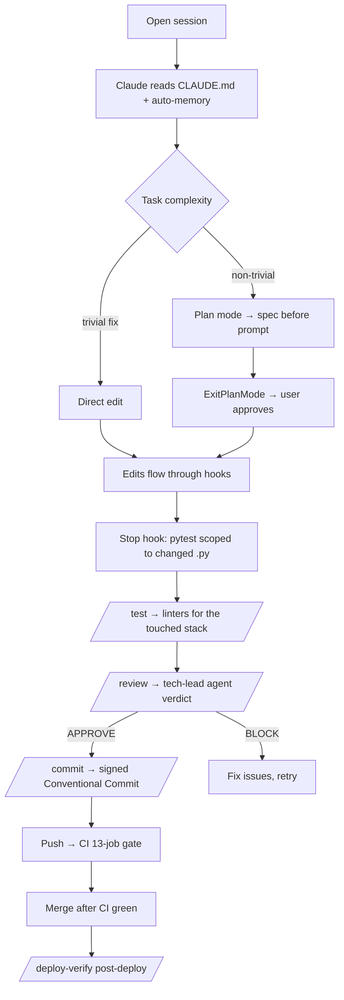

# Working with AI on this repo

> **Status:** Active
> **Last reviewed:** 2026-05-07
> **Owner:** @ariel-extending851

How a contributor uses [Claude Code](https://claude.com/claude-code) (or any LLM agent) on this repo without setting fire to it. Companion to [`CLAUDE.md`](../../CLAUDE.md), which carries the technical rules read by the agent on every turn — this doc is the human-facing operations manual.

---

## Setup (one-time)

```bash
# Tools (mise reads .mise.toml; Claude Code is invoked separately)
curl https://mise.jdx.dev/install.sh | sh
mise install

# Claude Code CLI — install per https://claude.com/claude-code (npm or platform installer)
claude --version
```

Then verify the per-project setup:

```bash
ls .claude/                    # agents/, commands/, hooks/, settings.json
head -10 CLAUDE.md             # orientation block; agent reads this on every turn
cat .claude/settings.json | jq '.permissions'  # allow + deny lists
```

If `.claude/settings.local.json` doesn't exist yet it's fine — that file is gitignored and holds your personal overrides only.

---

## The flow



The four phases that matter:

1. **Spec → plan** for anything non-trivial. Claude Code's plan mode enforces this by blocking edits until you approve.
2. **Edit → hooks defend**. SOPS files, secret paths, and destructive shell are blocked at the tool layer (see [Hooks](#hooks-active) below).
3. **`/review` → `/commit`**. The tech-lead agent reviews staged changes and `/commit` only proceeds if the verdict is `APPROVE` (or you explicitly override `WARN`). Commits are always explicitly triggered by a human; the agent never auto-commits.
4. **CI as the definitive gate**. Local `make validate-*` is the first signal; the 13-job pipeline (`.github/workflows/ci-validation.yml`) is what blocks merge.

---

## Slash commands

All commands live in [`.claude/commands/`](../../.claude/commands/) — read the file for full instructions.

| Command | Purpose | When |
|---|---|---|
| `/review` | Pre-commit code review via the `tech-lead` subagent | Auto-invoked by `/commit`; or run manually before staging |
| `/security` | Targeted security audit (IAM/RBAC/SOPS/NetworkPolicy/images) via the `security-reviewer` subagent | Manually before `/commit` on PRs touching `infra/aws-oidc/`, `k8s/**/secret.yaml`, `.trivyignore.yaml`, etc. |
| `/incident` | Runbook-first incident response via the `sre` subagent (RO diagnostics → propose → confirmation gate → postmortem) | When something breaks in prod (control plane, Tailscale, ArgoCD app stuck) |
| `/commit` | Generate signed Conventional Commit; runs `/review` first | After staging changes |
| `/test` | Run linters for the touched stack (Python / TF / Ansible / k8s / Shell / Workflows) | After meaningful edits |
| `/bug` | TDD bug investigation (Red → Green → Refactor) | Reproducing an issue |
| `/learn` | Save a lesson to auto-memory | After discovering a non-obvious fact |
| `/rollback` | ArgoCD app rollback with confirmation + incident doc | Production incident |
| `/deploy-verify` | Post-deploy ArgoCD sync/health check | After `make deploy` or merge to `develop` |
| `/pr-review [N]` | View PR status, CI checks, and review threads | Before responding to review |
| `/pr-resolve [N]` | Resolve all review threads on a PR | After addressing feedback |

---

## Hooks active

Wired in [`.claude/settings.json`](../../.claude/settings.json), implemented in [`.claude/hooks/`](../../.claude/hooks/). They run automatically — you don't invoke them.

| Event | Hook | Behavior |
|---|---|---|
| `PreToolUse` Edit/Write | `block-sops.sh` | Blocks editing of `*.sops.yaml`, `secret.yaml` under `k8s/apps/` |
| `PreToolUse` Bash | `warn-destructive.sh` | Blocks `git push --force`, `terraform destroy`, `kubectl delete ns`, `rm -rf /`, etc. |
| `PreToolUse` Bash/Read/Grep/Glob | `block-secret-read.sh` | Blocks reads of `~/.config/sops/**`, `~/.ssh/**`, `~/.aws/credentials` |
| `PostToolUse` Edit/Write | `lint-on-edit.sh` | Runs the right linter for the edited file (informational, never blocks) |
| `Stop` | `verify-tests.sh` | Runs `pytest` scoped to `.py` files changed since last commit (fast, not full suite) |

If a hook blocks a legitimate operation, the fix is to edit the hook script (small, well-commented), not to `--no-verify` your way around.

---

## When you discover a hurdle

This is the loop that makes the system improve over time. From `CLAUDE.md`'s `## How we work here`:

> **Hurdles documentados no mesmo PR.** When you discover a non-obvious failure mode, add an entry to `docs/runbooks/` or auto-memory **in the same PR that fixes it**.

Concrete examples already documented this way: EBS-swap blocked by fleet, Tailscale logout silencing the cluster, `kubectl wait` timing out under SSM. See `## Common hurdles` in `CLAUDE.md`.

---

## Updating the rules

Where to edit when you want to change agent behavior:

| Want to change… | Edit |
|---|---|
| What the agent reads first every session | [`CLAUDE.md`](../../CLAUDE.md) (root) |
| Tech-lead persona / anti-rationalization rules | [`.claude/agents/tech-lead.md`](../../.claude/agents/tech-lead.md) |
| Security audit checklist (IAM, RBAC, SOPS, supply chain) | [`.claude/agents/security-reviewer.md`](../../.claude/agents/security-reviewer.md) |
| Incident response decision tree, runbook map | [`.claude/agents/sre.md`](../../.claude/agents/sre.md) |
| Slash command behavior | [`.claude/commands/<cmd>.md`](../../.claude/commands/) |
| What's blocked / allowed at the tool layer | [`.claude/hooks/`](../../.claude/hooks/) and [`.claude/settings.json`](../../.claude/settings.json) `permissions.allow`/`deny` |

Every change ships as a normal PR — no special workflow.

---

## Troubleshooting

- **`/review` doesn't invoke the agent.** Check the YAML frontmatter at the top of `.claude/agents/tech-lead.md` — `name`, `description`, `tools`, `model` are all required for subagent discovery.
- **Stop hook hangs.** It runs `pytest` on changed `.py` files. If your edit removed the source script but the test still imports it, the hook surfaces the error — restore or update the production code/imports. Do not edit tests to bypass the failure.
- **Permission prompt spam.** Audit `.claude/settings.json` `permissions.allow` (current entries cover the 27 most-frequent read-only patterns). If you find yourself repeatedly approving the same command, add it to the list — but only if it's strictly read-only.
- **"Does this command get blocked?"** Test with the hook directly: `echo '{"tool_input":{"command":"<cmd>"}}' | bash .claude/hooks/warn-destructive.sh; echo $?` — exit 2 means blocked.

---

## Pointers

- Technical rules read by the agent → [`CLAUDE.md`](../../CLAUDE.md)
- Project architecture → [`docs/architecture/overview.md`](../architecture/overview.md)
- Naming and code-style conventions → [`docs/CONVENTIONS.md`](../CONVENTIONS.md)
- Auto-memory used across sessions → `~/.claude/projects/<workspace>/memory/` (workspace name comes from your local Claude Code project)
