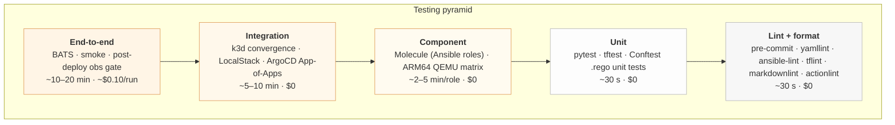

# Testing Strategy

> **Status:** Active
> **Last reviewed:** 2026-05-12
> **Owner:** @ariel-extending851

This repo's tests are organized as a **testing pyramid**: many fast checks at the bottom, fewer slow checks at the top. Every PR runs the entire pyramid up to "Integration." The "End-to-end" tier runs post-deploy on `main`. The shape is intentional — defect density vs. cost-per-test is the trade-off that drives it.



The Makefile is the authoritative entry point for every layer; `.github/workflows/ci-validation.yml` and `ci-deployment.yml` invoke the same targets a developer runs locally. Local runs equal CI runs — that is the contract.

---

## 1. Tier-by-Tier

| Tier | Scope | Tools | Make target | Speed | Money |
|---|---|---|---|---|---|
| **Lint + format** | Style, syntax, structure | yamllint, ansible-lint, tflint, terraform fmt, shellcheck, black, ruff, markdownlint, actionlint, zizmor | `make validate-yaml-lint`, `make validate-terraform-all`, `make lint-workflows` | <30 s | $0 |
| **Unit** | One function / one resource / one rule | pytest (`bin/tests/`), tftest (`*.tftest.hcl`), Conftest rule fixtures | `make test-python`, `make test-terraform`, `make validate-k8s-policies` | ~30 s | $0 |
| **Component** | One role end-to-end in isolation | Molecule (Docker + QEMU/ARM64), idempotency check | `make test-molecule`, `make test-molecule-<role>`, `make test-molecule-arm64` | 2–5 min/role | $0 |
| **Integration** | Cross-module composition without real cloud | k3d ArgoCD convergence, LocalStack Terraform plan | [`bin/k3d_convergence.py`](../../bin/k3d_convergence.py), `python3 infra/aws/scripts/validate_localstack.py` | 5–10 min | $0 |
| **End-to-end** | Real cluster, post-deploy contract | BATS, smoke, observability gate, Velero restore drill, Ansible idempotency | `make smoke-test`, `make test-e2e-post-deploy`, `make test-velero-restore`, `make test-ansible-idempotency` | 10–20 min | ~$0.10 |

CI runs every tier except the final end-to-end on every PR. The end-to-end tier fires on `main` push only via [`ci-deployment.yml`](../../.github/workflows/ci-deployment.yml).

---

## 2. TDD as Operational Discipline

The repo enforces **reproduction-first** TDD on bug fixes:

1. A bug is filed.
2. A failing test is committed that reproduces the bug at the *right layer of the pyramid* (a missing readiness probe is a Conftest unit test, not an E2E BATS test).
3. The fix lands in the same PR. CI proves the previously-failing test now passes.

This discipline is encoded in the `/bug` skill and is the reason this repo has tests covering historical failure modes that are otherwise hard to reproduce — e.g., the stale `--node-ip` after Tailscale rejoin (auto-memory `project_prod_deploy_2026_05.md`), and the SSM-bucket-override gotcha ([`staging-deploy-2026-05-postmortem.md`](../runbooks/staging-deploy-2026-05-postmortem.md)).

!!! abstract "Decision: idempotency is a test, not a convention"
    `make test-ansible-idempotency` and the matching `*.tftest.hcl` invariants treat *"running this twice produces the same state"* as a property to verify, not a goal to aspire to. Every Molecule scenario re-runs the role and asserts zero `changed` tasks on the second pass. A role that is not idempotent does not merge.

---

## 3. Test Code Placement

| Test kind | Location | Why here |
|---|---|---|
| Python unit / contract tests for any script | [`bin/tests/`](../../bin/tests/) (pytest + Bats) | Single pytest config in [`pyproject.toml`](../../pyproject.toml); one `conftest.py`; one coverage gate. Source location (`bin/`, `ansible/scripts/`, `infra/aws/scripts/`) is irrelevant. |
| Shared pytest config | [`bin/tests/conftest.py`](../../bin/tests/conftest.py) | Discoverable by `pytest` from repo root |
| Terraform native tests (`*.tftest.hcl`) | `infra/aws/tests/`, `infra/<module>/tests/` | Co-located with the module they test; `terraform test` finds them automatically |
| Ansible Molecule | `ansible/roles/<role>/molecule/default/` | Molecule's design; CI's `enforce-molecule-tests` job fails on a role without it |
| Lambda package tests | [`infra/aws/modules/scheduler/lambda_src/tests/`](../../infra/aws/modules/scheduler/lambda_src/tests/) | **Exception:** the Lambda is zipped as a unit; tests travel with the package |

Adding a new test file under `bin/tests/test_*.py` is picked up automatically by pytest discovery configured in `testpaths`.

---

## 4. Tier Details

### 4.1 Lint + format (Tier 1)

```bash
make validate-yaml-lint        # yamllint + ansible-lint
make validate-shellcheck       # shell scripts (this repo prefers Python)
make validate-terraform-all    # terraform fmt -check, validate, tflint across infra/
make validate-k8s-all          # kustomize build + kubeconform on every overlay
make validate-k8s-policies     # Conftest against k8s/policies/*.rego (also Tier 2 — see below)
make validate-sops-workflow    # asserts every encrypted file matches .sops.yaml rules
make lint-workflows            # actionlint + zizmor on .github/workflows/
```

The pre-commit hooks ([`.pre-commit-config.yaml`](../../.pre-commit-config.yaml)) run a subset on every commit; CI re-runs the full set against the PR diff. See [`../security/static-analysis.md`](../security/static-analysis.md) for the security-relevant lints (TruffleHog, Checkov, Trivy).

### 4.2 Unit (Tier 2)

#### Python

```bash
make test-python               # pytest with coverage
make test-python-coverage      # HTML report at htmlcov/index.html
```

CI fails the build if total coverage drops below **70%**. Current coverage: scheduler Lambda 100%, Terraform inventory ~70%.

#### Terraform (`.tftest.hcl`)

Native `terraform test` framework — no LocalStack needed for module-logic assertions.

```bash
make test-terraform
# or directly:
cd infra/aws && terraform test
```

#### Conftest unit tests

`.rego` rules in [`k8s/policies/`](../../k8s/policies/) have matching test fixtures. `make validate-k8s-policies` runs both schema validation and the rule fixtures.

#### Performance benchmarks

```bash
make test-performance          # fails if >10% regression vs. baseline
make performance-baseline      # save current as new baseline (intentional optimization)
```

Baseline lives in `.benchmarks/baseline.json` (git-tracked).

### 4.3 Component (Tier 3) — Molecule

Each role under [`ansible/roles/`](../../ansible/roles/) has a `molecule/default/` scenario that:

1. Spins up a container playing the target OS.
2. Runs the role.
3. Verifies expected state via `verify.yml`.
4. Re-runs the role and asserts idempotency.

CI gate: every role must have `molecule/default/` (`enforce-molecule-tests` job).

```bash
make test-molecule                  # all roles
make test-molecule-k3s              # single role (default + health + install + agent)
make test-molecule-rpi              # rpi_optimization (default + sysctl + rpi3)
make test-molecule-tailscale
make test-molecule-argocd           # default + sops
make test-molecule-gatekeeper
make test-molecule-emergency-recovery
make test-molecule-arm64            # ARM64 matrix via QEMU (~45 min, RPi regressions)
make test-molecule-lint             # ansible-lint + yamllint across all roles
```

Idempotency is enforced *inside* each Molecule scenario; [`bin/check_molecule_idempotence.py`](../../bin/check_molecule_idempotence.py) also runs as a standalone gate.

### 4.4 Integration (Tier 4)

#### k3d convergence

[`bin/k3d_convergence.py`](../../bin/k3d_convergence.py) brings up a local k3d cluster, applies the App-of-Apps root, and asserts every Application reaches `Synced + Healthy` within a deadline. This catches ArgoCD ordering bugs and CMP-SOPS integration regressions without spending AWS dollars.

#### LocalStack — Terraform without AWS

LocalStack mocks AWS APIs sufficiently to validate Terraform module structure, variable behavior, and the resource graph. The wrapper:

```bash
LOCALSTACK_VERSION=$(awk -F'"' '/^localstack/ {print $2; exit}' .mise.toml)
docker run -d --name localstack -p 4566:4566 -e SERVICES=ec2,iam,ssm \
  localstack/localstack:"${LOCALSTACK_VERSION}"
sleep 15
cd infra/aws && python3 scripts/validate_localstack.py
```

| Component | LocalStack covers? | Alternative |
|---|---|---|
| Terraform syntax + module structure | ✅ | — |
| Variable validation | ✅ | — |
| Resource dependency graph | ✅ | — |
| Provider configuration | ✅ | — |
| EC2 spot instance behavior | ❌ | Real apply |
| User-data execution (k3s install) | ❌ | SSH to a real instance after deploy |
| IAM permission enforcement | partial | Real apply + post-deploy contract test |
| Security-group rule enforcement | ❌ | Real apply |

### 4.5 End-to-end (Tier 5)

Run only against a real cluster, after `make deploy` succeeds. CI runs these on every `main` push.

```bash
make smoke-test                 # HTTP checks across every app
make test-e2e-post-deploy       # BATS contract tests
make test-velero-restore        # backup → delete → restore → integrity
make test-ansible-idempotency   # site.yml twice; assert zero changed
```

#### Observability gate

`Synced + Healthy` is necessary but not sufficient — a pod can flap into `CrashLoopBackOff` seconds after sync, or a Deployment can satisfy `availableReplicas` while a sidecar is OOMing. The observability gate runs *after* `validate-argocd-synced` and queries Prometheus directly:

- `kube_pod_container_status_last_terminated_reason{reason="OOMKilled"}`
- `kube_deployment_status_replicas_unavailable`
- `kube_pod_container_status_waiting_reason{reason="CrashLoopBackOff"}`

```bash
kubectl port-forward -n prometheus svc/prometheus 9090:9090 &
PROMETHEUS_URL=http://localhost:9090 OBSERVATION_WINDOW=300 \
  python3 bin/post_deploy_observability_gate.py
```

Source: [`bin/post_deploy_observability_gate.py`](../../bin/post_deploy_observability_gate.py). Exit non-zero blocks deploy in `ci-deployment.yml`.

#### Other E2E targets

```bash
make test-rpi                      # RPi-specific node validation
make test-security                 # secret leakage, RBAC wildcards
make test-security-supply-chain    # image SBOM + vuln scan
make test-sops                     # all expected SOPS files exist + decrypt
make test-acl-json                 # Tailscale ACL validation
make test-contracts                # AWS CLI contract tests in bin/tests/contracts/
make test-dr-execution             # disaster recovery scenario
```

---

## 5. CI Integration

### 5.1 `ci-validation.yml` (every PR)

13 parallel jobs (one mise cache per job, keyed on `.mise.toml`):

- `terraform-validate` + `terraform-test`
- `yamllint`, `kubeconform`, `ansible-lint`, `actionlint`/`zizmor`
- `molecule` (per-role matrix)
- `molecule-arm64` (QEMU)
- `python-unit` + coverage gate
- `python-benchmarks` (regression check)
- `conftest-policies`
- `trufflehog`, `trivy-image-scan`, `trivy-config-scan`
- `checkov`
- `pipeline-gate` (aggregator — the only job branch protection requires)

### 5.2 `ci-deployment.yml` (push to `main`)

Sequential, all Make targets:

1. `terraform-apply`
2. `ansible-deploy`
3. `validate-argocd-synced`
4. `smoke-test`
5. `test-e2e-post-deploy`
6. Rollback playbook on failure (`rollback-tf-refresh`, `rollback-argocd-status`)

The Makefile is the single source of truth — running these locally is identical to CI.

---

## 6. Tooling Prerequisites

All tools pinned in [`.mise.toml`](../../.mise.toml). One-time install:

```bash
mise install
make setup-ci-deps-all     # verifies + supplements (pytest-cov, boto3, ...)
```

| Tool | Purpose |
|---|---|
| `terraform`, `tflint`, `sops`, `age`, `kubectl`, `kustomize`, `kubeconform` | Infra + K8s validation |
| `ansible-core`, `ansible-lint`, `molecule`, `community.aws`, `community.sops` | Ansible component tests |
| `pytest`, `pytest-cov`, `pytest-benchmark` | Python unit + benchmark |
| `bats` | BATS smoke + contract tests |
| `localstack`, `terraform-local`, `awscli-local` | Integration without AWS |
| `conftest` | OPA policy unit + integration |
| `actionlint`, `zizmor` | GitHub Actions linting + security |
| `trivy`, `checkov`, `trufflehog`, `cosign`, `syft` | Security (see [`../security/static-analysis.md`](../security/static-analysis.md)) |

---

## 7. QA Scorecard

```bash
make qa-scorecard                  # qa-scorecard.md with coverage, lint pass rates, security findings
make qa-audit                      # which tests skipped, durations
make qa-verify-required-no-skips   # fails if a required test was skipped without justification
```

---

## 8. Checklist Before Merging Infrastructure Changes

- [ ] `make validate-terraform-all` passes
- [ ] `make test-terraform` passes
- [ ] `make test-molecule-<role>` passes for any role touched
- [ ] LocalStack plan succeeds (`python3 infra/aws/scripts/validate_localstack.py`)
- [ ] If touching Lambda/scheduler: `make test-python` ≥ 70 % coverage, no benchmark regression
- [ ] If touching K8s manifests: `make validate-k8s-all` + `make validate-k8s-policies-critical`
- [ ] If touching SOPS rules: `make test-sops` and `make validate-sops-workflow`
- [ ] After deploy: `make smoke-test` returns 0

---

## 9. Related

- **Terraform operations:** [`terraform.md`](terraform.md)
- **Ansible operations:** [`ansible.md`](ansible.md)
- **SOPS workflow:** [`sops-setup.md`](sops-setup.md)
- **Static analysis (security):** [`../security/static-analysis.md`](../security/static-analysis.md)
- **Runtime enforcement:** [`../security/runtime-enforcement.md`](../security/runtime-enforcement.md)
- **Per-app health checks:** the relevant page under [`../services/`](../services/)
