# Security Overview

> **Status:** Active
> **Last reviewed:** 2026-05-12
> **Owner:** @ariel-extending851

Current security posture for the homelab. This page is the index — controls are described here at a single level of detail; depth is in the linked sub-pages. The chronological record (audits, fix plans, finding remediation) is in [`audit-history.md`](audit-history.md).

---

## Defense in Depth

The security stack is organized along the request lifecycle. Every invariant is enforced at the earliest point where it can be enforced, then re-enforced at later points so a bypass at one layer is caught by the next.

```mermaid
flowchart LR
    LAPTOP["Operator laptop<br/>pre-commit"]
    PR["Pull request<br/>CI gates"]
    REG["Registry<br/>image signed at digest"]
    ADM["Cluster admission<br/>Kyverno"]
    RUN["Runtime<br/>Falco eBPF"]

    LAPTOP --> PR --> REG --> ADM --> RUN

    LAPTOP -.->|TruffleHog · terraform fmt · shellcheck · black · ruff| PR
    PR -.->|Trivy · Checkov · Conftest · kubeconform · ansible-lint| REG
    REG -.->|Syft SBOM · Cosign keyless sign| ADM
    ADM -.->|ClusterPolicy verify · resource limits · seccomp| RUN
    RUN -.->|syscall-derived findings → otel-collector → Loki| RUN

    classDef gate fill:#fff5e6,stroke:#e0a060
    class LAPTOP,PR,REG,ADM,RUN gate
```

| Layer | Sub-page | What it answers |
|---|---|---|
| Shift-left static analysis | [`static-analysis.md`](static-analysis.md) | "Is this change safe to merge?" |
| Supply-chain provenance | [`supply-chain.md`](supply-chain.md) | "Did *we* build the image that is about to run?" |
| Runtime enforcement + detection | [`runtime-enforcement.md`](runtime-enforcement.md) | "Should this Pod exist, and is it behaving?" |
| Network segmentation | [`network-policies.md`](network-policies.md) | "Can A reach B?" |

---

## Threat Model

What we're protecting against:

| Threat | Mitigation |
|---|---|
| Public internet attack on the cluster | Zero public ingress. SSH/k3s API only via Tailscale or AWS SSM ([`../architecture/networking.md`](../architecture/networking.md)) |
| Container escape | Non-root containers, dropped capabilities, allowPrivilegeEscalation: false everywhere except where it's a hard requirement |
| Stolen Git access | SSH deploy key (read-only) + 2FA on GitHub + branch protection on `develop` |
| Stolen AWS credentials | OIDC for CI (no static keys); SOPS encrypts the only Terraform secrets |
| Compromised cluster node accessing other nodes' secrets | SSM transfer bucket is **separate** from Terraform state bucket |

What we're **not** protecting against:

- Insider threat from the (sole) operator
- Loss of the SOPS age private key (catastrophic — backup is the only mitigation)

---

## Posture Summary

### Network

- **Zero public ingress** — `infra/aws/modules/network` security group has no `0.0.0.0/0` rule
- **All traffic encrypted** — Tailscale (WireGuard) for operator access, ts.net TLS for app ingress

### Identity

- **No long-lived AWS keys** — CI uses GitHub OIDC; operator uses local AWS profile on a tailnet host
- **No SSH passwords** — Tailscale plus AWS SSM only (no public SSH at all)
- **GitHub deploy key** for ArgoCD is **read-only** (cannot push from cluster)
- **Tailscale auth keys** rotated every ~90 days

### Workload

- **All containers run non-root** except where functionally required:
- **`allowPrivilegeEscalation: false`** enforced cluster-wide via the [`security_context.rego`](../../k8s/policies/security_context.rego) policy
- **Resource limits required** on every container via [`resource_limits.rego`](../../k8s/policies/resource_limits.rego)

### Secrets

- **SOPS + age** for everything: Terraform vars, K8s Secret manifests, Ansible group vars
- **Pre-commit hook** refuses to commit anything matched by `.sops.yaml` rules without encryption
- **Age private key** on workstation only; never in git, never in CI
- **CI cannot decrypt** — runs with mock secrets via `localstack_test=yes`
- **At-rest:** EBS encrypted, S3 SSE-S3, K8s Secrets stored as base64 (not encrypted at rest in etcd by default — acceptable for homelab; consider KMS provider if scaling up)

### Audit Trail

- **Every change** committed to git (signed when possible, branch-protected on `develop`)
- **CloudTrail** captures all AWS API calls
- **ArgoCD sync log** records every K8s state change
- **GitHub PR review** required before merge (squash + protected branch)

---

## Compliance Snapshot

| Standard | Item | Status |
|---|---|---|
| CIS Kubernetes Benchmark 5.2.1 | No privileged containers | ✅ Cluster-wide; verified by `make validate-k8s-policies` |
| CIS K8s 5.2.7 | `allowPrivilegeEscalation: false` | ✅ Enforced by policy |
| CIS K8s 5.2.9 | Drop capabilities | ✅ All drop ALL except documented exceptions |
| AWS Well-Architected (Sec) | Least privilege IAM | ✅ |
| AWS Well-Architected (Sec) | Encryption at rest + in transit | ✅ EBS + Tailscale + ts.net TLS |
| AWS Well-Architected (Sec) | No long-lived keys in CI | ✅ OIDC |

The OPA policy files in [`k8s/policies/`](../../k8s/policies/) are the enforcement mechanism — they fail PRs in `make validate-k8s-policies-critical`.

---

## Known Open Items

See [`fixes-backlog.md`](fixes-backlog.md) for the full list. Highlights:

- **Image versioning** — currently using `:latest` for several apps; planned migration to ArgoCD Image Updater for automated semver pinning
- **etcd encryption at rest** — K8s Secrets are base64'd in etcd. Acceptable for solo homelab; would need an upstream KMS provider for production-grade
- **Supply chain (SBOM)** — `make test-security-supply-chain` runs but no automatic image vulnerability gating yet

---

## When Things Go Wrong

| Scenario | Where to look |
|---|---|
| Cluster suddenly unreachable | [`../runbooks/control-plane-recovery.md`](../runbooks/control-plane-recovery.md) or [`../runbooks/tailscale-logged-out.md`](../runbooks/tailscale-logged-out.md) |
| Suspicious Tailscale device appeared | Tailscale admin → revoke → rotate auth keys → re-run gateway role: `make ansible-router` |
| GitHub credential leak | Rotate SOPS age key (see [`../operations/sops-setup.md#rotate-the-age-key`](../operations/sops-setup.md#rotate-the-age-key)), regenerate ArgoCD deploy key, force-rotate Tailscale OAuth client |

---

## Related

- **Supply-chain signing chain (Syft + Cosign + Kyverno verify):** [`supply-chain.md`](supply-chain.md)
- **Admission and runtime enforcement (Kyverno + Falco):** [`runtime-enforcement.md`](runtime-enforcement.md)
- **Pre-merge static analysis (Trivy, Checkov, TruffleHog, Conftest):** [`static-analysis.md`](static-analysis.md)
- **NetworkPolicy detail:** [`network-policies.md`](network-policies.md)
- **Audit history (chronological record):** [`audit-history.md`](audit-history.md)
- **Open security work:** [`fixes-backlog.md`](fixes-backlog.md)
- **Secrets architecture:** [`../architecture/secrets-management.md`](../architecture/secrets-management.md)
- **SOPS key rotation procedure:** [`../runbooks/sops-key-rotation.md`](../runbooks/sops-key-rotation.md)
