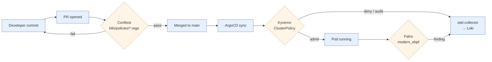

# Runtime Enforcement

> **Status:** Active
> **Last reviewed:** 2026-05-12
> **Owner:** @ariel-extending851

The cluster enforces security policy at three points in the request lifecycle. **Conftest (OPA)** rejects non-compliant manifests at PR time. **Kyverno** rejects non-compliant Pods at admission. **Falco** detects anomalous behavior at runtime. The same invariant (e.g., "no privilege escalation") is encoded at each layer so a bypass at one tier is caught by the next.

This document is the runtime arm. Pre-merge static analysis is covered in [`static-analysis.md`](static-analysis.md); the supply-chain signature chain is in [`supply-chain.md`](supply-chain.md).

---

## 1. Defense in Depth



| Layer | Tool | Where it runs | What it answers |
|---|---|---|---|
| Pre-merge | Conftest / OPA | CI (`make validate-k8s-policies`) | "Would this manifest be safe to apply?" |
| Admission | Kyverno ClusterPolicy | Cluster (`kyverno` namespace) | "Should this Pod be created right now?" |
| Runtime | Falco | DaemonSet on every node | "Is this running Pod behaving as expected?" |

!!! abstract "Decision: Conftest at PR time AND Kyverno at admission"
    Conftest catches drift at the source-of-truth (git); Kyverno catches drift in the cluster (manifests that bypass the PR gate via `kubectl apply -f`, helm out-of-band, or an operator that generates resources at runtime). Each tier protects against a failure mode the other cannot see. Duplicating the same invariant across both is intentional, not redundant.

---

## 2. Kyverno ClusterPolicy Inventory

Every policy lives in [`k8s/system/kyverno/policies/`](../../k8s/system/kyverno/policies/) and is reconciled by ArgoCD. The corresponding pre-merge Conftest rule is referenced where one exists.

| ClusterPolicy | Severity | Mode | Mirrors (Conftest) | Why it exists |
|---|---|---|---|---|
| `hl-disallow-privilege-escalation` | high | Audit | [`security_context.rego`](../../k8s/policies/security_context.rego) | `allowPrivilegeEscalation: true` is a primary container-escape vector |
| `hl-disallow-rbac-wildcards` | high | Audit | [`rbac_safety.rego`](../../k8s/policies/rbac_safety.rego) | A `verbs: ["*"]` Role compromises blast-radius analysis and breaks least-privilege |
| `hl-require-resource-limits` | medium | Audit | [`resource_limits.rego`](../../k8s/policies/resource_limits.rego) | Unbounded containers can starve neighbors; especially destructive on the 1 GB RPi 3 (see [`../runbooks/rpi-oom-mitigation.md`](../runbooks/rpi-oom-mitigation.md)) |
| `hl-require-readiness-probe` | medium | Audit | [`health_probes.rego`](../../k8s/policies/health_probes.rego) | Without a readiness probe, a Service sends traffic to pods that are not actually ready, breaking rollout availability |
| `hl-require-seccomp-runtime-default` | medium | Audit | n/a | Default seccomp profile blocks ~40 rarely used syscalls; the kernel attack surface drops accordingly |
| `hl-verify-image-signatures` | high | Audit | n/a | Cosign keyless signature check on first-party images (see [`supply-chain.md`](supply-chain.md)) |

!!! note "Mode: Audit (transition state)"
    All policies are currently in `validationFailureAction: Audit`. Each policy's file header documents its flip criteria — typically: one clean reporting cycle on `make validate-argocd-synced` plus zero unexpected `PolicyReport` entries against in-tree workloads. Promotions to `Enforce` are recorded in [`audit-history.md`](audit-history.md).

### 2.1 Mode promotion procedure

1. **Observe.** `kubectl get clusterpolicyreport -A -o wide` should be empty (or contain only known, allow-listed entries) across two consecutive sync cycles.
2. **Pre-merge gate.** Confirm the Conftest mirror catches the same invariant on a known-bad fixture (`bin/tests/policies/<name>_test.rego`).
3. **Flip.** Patch the file: `validationFailureAction: Enforce`. Commit and let ArgoCD reconcile.
4. **Post-flip canary.** Watch for 24 h. The first unexpected denial is a regression in the policy or a workload that has drifted off-standard — investigate before adding an exception.
5. **Record.** Append a line to [`audit-history.md`](audit-history.md) with date, policy, observed cycles, and outcome.

---

## 3. Admission Flow

```mermaid
sequenceDiagram
    autonumber
    participant Client as kubectl / ArgoCD
    participant API as kube-apiserver
    participant Webhook as Kyverno admission webhook
    participant Pol as ClusterPolicy
    participant Falco as Falco DaemonSet
    participant Otel as otel-collector

    Client->>API: create Pod
    API->>Webhook: AdmissionReview (Pod)
    Webhook->>Pol: evaluate rules (parallel)
    alt all pass
        Pol-->>Webhook: allowed
        Webhook-->>API: admit (optionally mutated digest)
        API->>API: schedule pod
    else any deny + Enforce
        Pol-->>Webhook: denied
        Webhook-->>API: 403 with policy message
        API-->>Client: error
    else any deny + Audit
        Pol-->>Webhook: PolicyReport entry
        Webhook-->>API: admit (warn)
        Otel<<-Pol: emit audit event
    end

    Note over Falco,Otel: After admission, every running pod is observed
    Falco->>Otel: syscall-derived security event
```

The `webhookTimeoutSeconds: 30` ceiling on each policy is intentional: a slow webhook is a hard dependency on the cluster's ability to create pods. If a policy needs longer than 30 s, the policy is wrong, not the timeout.

---

## 4. Falco — Runtime Detection

Falco runs as a DaemonSet ([`k8s/apps/falco/`](../../k8s/apps/falco/)) on every node with the `modern_ebpf` probe kind. It attaches eBPF programs to syscall tracepoints and emits findings for behavior that no admission policy can catch:

- An unexpected `exec` into a long-running container (post-compromise lateral movement).
- A write to a path outside `/var/log` or the container's emptyDir (binary drop).
- A process spawning `sudo`, `nsenter`, or a shell when its baseline does not include them.
- A network connection to a destination outside the cluster's egress allowlist.

Findings flow to the `otel-collector` and from there to Loki, where they are correlated with workload metadata. The Falco ruleset is the upstream default plus the deltas in `k8s/apps/falco/configmap.yaml`.

!!! warning "Falco does not block; it observes."
    A Falco finding is a *signal*, not a *gate*. Response is procedural — see [`../runbooks/on-call.md`](../runbooks/on-call.md). The blocking layer is Kyverno; the detective layer is Falco. Conflating the two creates either a noisy gate or a silent detector.

---

## 5. Verification Commands

```bash
# 1. Show the live policy inventory and current mode
kubectl get clusterpolicy -o custom-columns=\
NAME:.metadata.name,\
ACTION:.spec.validationFailureAction,\
BG:.spec.background

# 2. Show recent audit findings
kubectl get clusterpolicyreport -A \
  -o jsonpath='{range .items[*]}{.metadata.namespace}{"/"}{.metadata.name}{"\t"}{.summary}{"\n"}{end}'

# 3. Tail Falco events
kubectl logs -n falco -l app=falco --tail=50 -f

# 4. Pre-merge: run Conftest against a manifest locally (same gate CI uses)
make validate-k8s-policies
```

---

## 6. Failure Modes and Recovery

| Symptom | Likely cause | First check |
|---|---|---|
| Every pod denied with `hl-verify-image-signatures` after a release | The signature workflow ran on a non-`main` ref; subject regex no longer matches | `cosign tree <image>` + inspect Rekor subject; reconcile policy or re-run workflow on `main` |
| Kyverno webhook timeout on every Pod create | Kyverno pod is OOM-killed (memory ceiling hit) | `kubectl describe pod -n kyverno`; raise the request after sizing against the 2 GB control-plane budget |
| Conftest passes but Kyverno denies the same manifest | Drift between `k8s/policies/*.rego` and `k8s/system/kyverno/policies/*.yaml` | Diff the two; the Conftest mirror is the source of intent — bring Kyverno into line |
| Falco silent after node reboot | `modern_ebpf` probe failed to attach (kernel/headers mismatch) | `kubectl logs -n falco <pod>` for `unable to load eBPF program`; pin Falco image to a tested release |

---

## 7. Related

- **Supply-chain signature chain (Syft + Cosign):** [`supply-chain.md`](supply-chain.md)
- **Pre-merge static analysis (Conftest, Trivy, Checkov, TruffleHog):** [`static-analysis.md`](static-analysis.md)
- **NetworkPolicy posture:** [`network-policies.md`](network-policies.md)
- **Resource-limit rationale on constrained nodes:** [`../operations/resource-limits.md`](../operations/resource-limits.md)
- **On-call response procedure:** [`../runbooks/on-call.md`](../runbooks/on-call.md)
