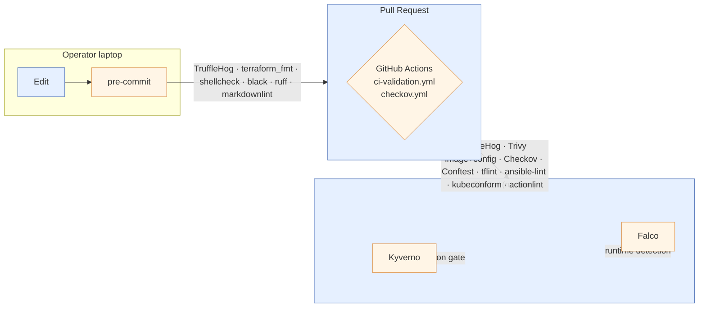

# Static Analysis (Shift-Left)

> **Status:** Active
> **Last reviewed:** 2026-05-12
> **Owner:** @ariel-extending851

Every commit passes through three concentric gates before it can reach the cluster: **the developer's laptop (pre-commit)**, **the PR build (CI)**, and **the cluster's admission webhook (Kyverno)**. This document covers the first two — the static-analysis layer that catches defects without ever booting a container.

The runtime arm (Kyverno + Falco) is documented in [`runtime-enforcement.md`](runtime-enforcement.md). The signature chain (Syft + Cosign) is in [`supply-chain.md`](supply-chain.md).

---

## 1. The Shift-Left Surface



The earlier a defect is caught, the cheaper it is to fix. Pre-commit catches the obvious things in <30 s; CI catches the cross-file and cross-resource concerns in 3–10 min; admission and runtime are the last line.

---

## 2. Tool Matrix

| Tool | Scope | Where it runs | Gate type | Source |
|---|---|---|---|---|
| **TruffleHog** | Verified secrets in commit diffs | `pre-commit` (pre-commit + pre-push), `ci-validation.yml` | Blocking | [`.pre-commit-config.yaml`](../../.pre-commit-config.yaml) |
| **terraform fmt + validate** | Terraform syntax + module integrity | pre-commit, `make validate-terraform-all` | Blocking | [`.pre-commit-config.yaml`](../../.pre-commit-config.yaml) |
| **tflint** | Terraform style + provider rules | `make validate-terraform-all`, CI | Blocking | [`.tflint.hcl`](../../.tflint.hcl) |
| **Checkov** | Terraform IaC posture (CIS, AWS WAF) | `.github/workflows/checkov.yml`, `make checkov-baseline` | Baseline-gated | [`.checkov.baseline`](../../.checkov.baseline) |
| **Trivy (image)** | OS + dep CVEs in container images | `make test-trivy` / `test-trivy-strict`, CI | Allowlist-gated, expiry-enforced | [`bin/trivy_scan.py`](../../bin/trivy_scan.py), [`.trivy-image-allowlist.txt`](../../.trivy-image-allowlist.txt) |
| **Trivy (config)** | Misconfig in K8s + Terraform | `make test-trivy-config`, CI | Advisory + curated filters | [`bin/trivy_config_scan.py`](../../bin/trivy_config_scan.py), [`.trivyignore.yaml`](../../.trivyignore.yaml) |
| **Conftest (OPA)** | K8s manifest policy | `make validate-k8s-policies`, CI | Blocking | [`k8s/policies/*.rego`](../../k8s/policies/) |
| **kubeconform** | K8s schema validation | `make validate-k8s-all`, CI | Blocking | n/a |
| **ansible-lint** | Ansible role/playbook posture | `make validate-yaml-lint`, CI | Blocking | `.ansible-lint` |
| **yamllint** | YAML well-formedness | pre-commit, CI | Blocking | `.yamllint` |
| **shellcheck** | Shell script defects | pre-commit, CI | Blocking | n/a |
| **black + ruff** | Python format + lint | pre-commit, CI | Blocking | `pyproject.toml` |
| **markdownlint** | Markdown style | pre-commit, CI | Blocking | n/a |
| **actionlint + zizmor** | GitHub Actions YAML lint + security | CI (`make lint-workflows`) | Blocking | n/a |

!!! note "Why TruffleHog, not Gitleaks"
    Both are credible. TruffleHog with `--only-verified` produces fewer false positives because it attempts a live credential probe before reporting (e.g., calls the AWS STS endpoint to confirm an AKIA-prefixed string is actually live). The trade-off is a small egress cost during scan; the win is that triaging the pre-push hook does not become its own time sink. The choice is recorded here so it does not get re-litigated.

---

## 3. Layered Operational Standard

### 3.1 Pre-commit (laptop)

Installation is one-time:

```bash
pre-commit install
pre-commit install --hook-type pre-push
```

After install, every `git commit` runs the laptop-side gates. The relevant hooks (in repo order):

- **TruffleHog** — scans the staged diff against the previous commit; refuses to commit if any *verified* secret is found.
- **terraform_fmt / terraform_validate** — formats inline; refuses on syntax error.
- **shellcheck** — every `*.sh` file.
- **black / ruff** — Python format + lint.
- **markdownlint** — Markdown style.

The full list is in [`.pre-commit-config.yaml`](../../.pre-commit-config.yaml). The CI re-runs the same hooks against the PR diff so a developer who has skipped pre-commit cannot merge non-conforming code.

### 3.2 Pre-merge (CI)

`ci-validation.yml` runs ~13 parallel jobs against every PR. The static-analysis-relevant jobs:

| Job | Gate |
|---|---|
| `trufflehog` | Re-scan PR diff for verified secrets |
| `checkov` | Terraform posture vs. `.checkov.baseline` |
| `trivy-image-scan` | First-party image CVEs (advisory + strict) |
| `trivy-config-scan` | K8s + Terraform misconfig |
| `conftest-policies` | `make validate-k8s-policies` |
| `kubeconform` | K8s schema validation |
| `terraform-validate` | `make validate-terraform-all` (incl. tflint) |
| `ansible-lint` + `molecule-lint` | Ansible structure + role lint |
| `yamllint` | Repository-wide YAML lint |
| `lint-workflows` | actionlint + zizmor on every workflow |

`pipeline-gate` is the aggregator job: it does not run anything itself; it requires the others to be green before the PR can merge. Branch protection points at `pipeline-gate` so the set of required checks is one name, not thirteen.

---

## 4. Notable Conventions

### 4.1 Baseline-gated tools (Checkov)

`make checkov-baseline` regenerates [`.checkov.baseline`](../../.checkov.baseline) — the list of findings that are explicitly accepted today. New PRs cannot introduce new findings, but old findings stay quiet until they are fixed. This avoids the failure mode of "tool noise prevents adoption" — every accepted finding is logged with a reason in the baseline file.

### 4.2 Allowlist + expiry (Trivy image)

A CVE in an upstream image we cannot patch ourselves is allow-listed in [`.trivy-image-allowlist.txt`](../../.trivy-image-allowlist.txt) **with an expiry date**. When the expiry date passes, CI fails, forcing a re-review. The current allowlist expires `2026-07-30`. Adding or removing an entry is procedurally documented in [`../runbooks/trivy-exceptions.md`](../runbooks/trivy-exceptions.md).

### 4.3 Curated filters (Trivy config)

Some misconfig findings have legitimate justifications in this repo's context — for example, allowing host-network on the AdGuard pod is required for LAN DNS, not a policy violation to fix. These are filtered in [`.trivyignore.yaml`](../../.trivyignore.yaml) with an inline justification per entry. The filter file is reviewed each time the security audit refreshes ([`audit-history.md`](audit-history.md)).

### 4.4 Mirrored invariants (Conftest ↔ Kyverno)

Where a Conftest `*.rego` rule exists, a matching Kyverno `ClusterPolicy` exists in [`k8s/system/kyverno/policies/`](../../k8s/system/kyverno/policies/). The CI gate catches drift at the source-of-truth; the admission gate catches drift at the cluster. See [`runtime-enforcement.md#22-mode-promotion-procedure`](runtime-enforcement.md#21-mode-promotion-procedure) for the relationship.

---

## 5. Verification Commands

```bash
# Run the full pre-merge static-analysis suite locally (same as CI)
make validate-yaml-lint
make validate-shellcheck
make validate-terraform-all
make validate-k8s-all
make validate-k8s-policies
make test-trivy-strict
make test-trivy-config
make checkov-baseline                # regenerates baseline; review the diff before committing

# Quick "did I leak a secret?" check matching the pre-push hook
trufflehog git file://. --since-commit HEAD~1 --only-verified --fail

# Full QA scorecard — coverage + lint + security findings in one Markdown report
make qa-scorecard
```

---

## 6. Failure Modes and Recovery

| Symptom | Likely cause | First check |
|---|---|---|
| CI red on `trivy-image-scan` after image bump | New HIGH/CRITICAL CVE in upstream image, no fix yet | Add a time-boxed allowlist entry (`.trivy-image-allowlist.txt`) with an expiry; record rationale in [`audit-history.md`](audit-history.md) |
| CI red on `checkov` after a new resource | New Terraform resource trips a CIS finding | Triage: legitimate fix or baseline accept. If accept, regenerate baseline + log reason |
| Pre-commit blocks the commit with a secret finding the author knows is a false positive | TruffleHog flagged an unrelated string | Confirm with `trufflehog git ... --only-verified` locally; if still flagged, scrub the string or use a placeholder |
| Conftest passes but Kyverno denies the same manifest in-cluster | Mirror drift between `k8s/policies/*.rego` and `k8s/system/kyverno/policies/*.yaml` | Diff the two files; bring Kyverno into line — Conftest is the source of intent |

---

## 7. Related

- **Runtime admission and detection:** [`runtime-enforcement.md`](runtime-enforcement.md)
- **Supply-chain signing:** [`supply-chain.md`](supply-chain.md)
- **NetworkPolicy:** [`network-policies.md`](network-policies.md)
- **Trivy exception lifecycle:** [`../runbooks/trivy-exceptions.md`](../runbooks/trivy-exceptions.md)
- **Open security work:** [`fixes-backlog.md`](fixes-backlog.md)
- **Testing strategy (pyramid):** [`../operations/testing.md`](../operations/testing.md)
