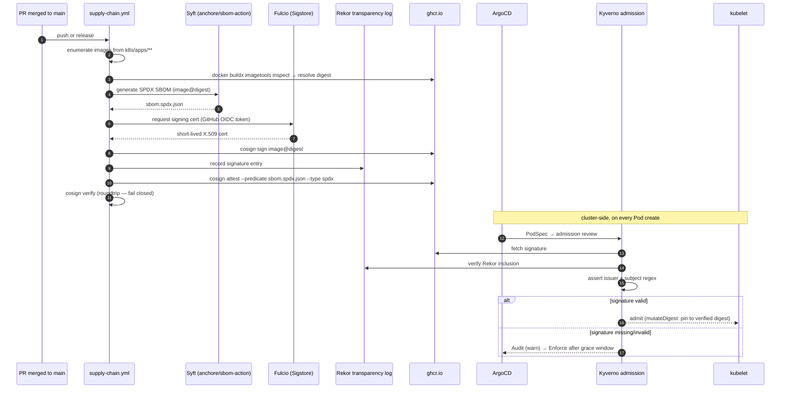

# Supply Chain Security

> **Status:** Active
> **Last reviewed:** 2026-05-12
> **Owner:** @ariel-extending851

Every first-party container image that lands in this cluster carries two artifacts: an **SPDX SBOM generated by Syft** and a **keyless Sigstore signature issued via GitHub OIDC**. Kyverno verifies the signature at admission. Upstream images are inventoried (SBOM-only) and gated by a runtime allowlist with expiry.

This document is the operational standard. Mechanics live in [`.github/workflows/supply-chain.yml`](../../.github/workflows/supply-chain.yml) and [`k8s/system/kyverno/policies/verify-image-signatures.yaml`](../../k8s/system/kyverno/policies/verify-image-signatures.yaml).

---

## 1. Threat Model

The supply-chain layer answers three specific failure modes:

| Threat | Control |
|---|---|
| Upstream registry compromise injects a malicious tag | SBOM at the digest, Trivy CVE allowlist with expiry, Kyverno `mutateDigest: true` pinning |
| Post-scan tag swap between build and admission | Cosign signature bound to image digest; Kyverno verification rejects unsigned digests |
| Long-lived signing key exfiltration | **No long-lived signing key exists** — keyless OIDC issues a Fulcio short-lived cert per build |
| Repudiation ("I didn't ship that image") | Rekor transparency log records every signature; verification rejects unknown subjects |

---

## 2. Pipeline



References:

- Workflow source: [`.github/workflows/supply-chain.yml`](../../.github/workflows/supply-chain.yml)
- Kyverno policy: [`k8s/system/kyverno/policies/verify-image-signatures.yaml`](../../k8s/system/kyverno/policies/verify-image-signatures.yaml)
- Sigstore Fulcio: <https://docs.sigstore.dev/fulcio/>
- Sigstore Rekor: <https://docs.sigstore.dev/rekor/>

---

## 3. Operational Standard

### 3.1 SBOM generation (Syft)

Every image referenced in `k8s/apps/**/deployment.yaml` or `daemonset.yaml` triggers SBOM generation. The workflow:

1. Enumerates `image:` references from the apps tree.
2. Resolves each reference to an immutable `image@sha256:...` digest using `docker buildx imagetools inspect`.
3. Invokes `anchore/sbom-action` (Syft) against the digest, producing `sbom.spdx.json` in SPDX-JSON format.
4. Uploads the SBOM as a workflow artifact (30-day retention).

SPDX-JSON is the chosen format because it round-trips through every SCA tool the project uses and is the de-facto interchange format for downstream verification.

### 3.2 Keyless signing (Cosign + GitHub OIDC)

For **first-party** images only — those whose reference matches `ghcr.io/<owner>/*` — the workflow:

1. Requests a short-lived Fulcio certificate using the workflow's GitHub OIDC token (`id-token: write` permission).
2. Runs `cosign sign --yes <image@digest>` — the signature is keyless; no private key exists or persists.
3. Runs `cosign attest --predicate sbom.spdx.json --type spdx <image@digest>` — the SBOM is attached as an in-toto SPDX attestation.
4. Runs `cosign verify` against its own output as a fail-closed roundtrip check. The verification asserts both the OIDC issuer (`token.actions.githubusercontent.com`) and the certificate subject (the workflow path on the `main` branch).

!!! abstract "Decision: keyless OIDC over long-lived signing keys"
    Long-lived signing keys require rotation, secure storage, and a recovery plan if compromised. Keyless signing pushes the entire trust chain onto GitHub's OIDC token and Sigstore's Fulcio — both already in use for Terraform plan in [`ci-validation.yml`](../../.github/workflows/ci-validation.yml). The marginal operational cost is zero; the marginal supply-chain protection is real.

Upstream images (Grafana, Prometheus, Falco, …) are SBOM'd but **not** re-signed under this repo's identity. They carry their own Sigstore signatures published by their upstream maintainers; re-signing would attest a provenance claim the repo cannot make.

### 3.3 Admission-time verification (Kyverno)

The `ClusterPolicy` `hl-verify-image-signatures` ([`k8s/system/kyverno/policies/verify-image-signatures.yaml`](../../k8s/system/kyverno/policies/verify-image-signatures.yaml)) matches every Pod whose image reference is under `ghcr.io/ariel-extending851/*` and:

- Requires a keyless Sigstore attestor with the workflow subject `…/supply-chain.yml@refs/heads/main`.
- Sets `mutateDigest: true` so the verified digest is pinned into the PodSpec — defeats post-admission tag swap.
- Records inclusion in Rekor (`https://rekor.sigstore.dev`).

!!! note "Current mode: Audit (will flip to Enforce)"
    The policy is in `validationFailureAction: Audit` mode while the first end-to-end signing run is observed and any unexpected first-party references are explicitly listed. The flip criteria are documented inline at the top of the policy file. Promotion to `Enforce` is tracked in [`fixes-backlog.md`](fixes-backlog.md) and will produce an [audit-history](audit-history.md) entry on completion.

---

## 4. Verification Commands

Operator-side sanity checks. Reuse these in incident response.

```bash
# 1. List signatures for a first-party image
cosign tree ghcr.io/ariel-extending851/<image>:<tag>

# 2. Verify the signature with the same constraints Kyverno applies.
#    The identity regexp matches the workflow's OIDC subject; the canonical
#    value lives in k8s/system/kyverno/policies/verify-image-signatures.yaml
#    (verify rule, attestor subject) — pull it from there to avoid drift.
IDENTITY=$(yq -r '.spec.rules[0].verifyImages[0].attestors[0].entries[0].keyless.subject' \
  k8s/system/kyverno/policies/verify-image-signatures.yaml)
ISSUER=$(yq -r '.spec.rules[0].verifyImages[0].attestors[0].entries[0].keyless.issuer' \
  k8s/system/kyverno/policies/verify-image-signatures.yaml)

cosign verify \
  --certificate-identity-regexp "^${IDENTITY%@*}@" \
  --certificate-oidc-issuer "${ISSUER}" \
  ghcr.io/ariel-extending851/<image>@sha256:<digest>

# 3. Inspect the attached SBOM
cosign download attestation \
  ghcr.io/ariel-extending851/<image>@sha256:<digest> \
  | jq -r '.payload' | base64 -d | jq '.predicate' > sbom.spdx.json

# 4. Cluster-side: show Kyverno verification outcomes
kubectl get clusterpolicyreport -A | grep hl-verify-image-signatures
```

---

## 5. Exceptions

Upstream images that cannot be re-signed under our identity are admitted through the runtime allowlist, **not** the signature policy. The allowlist:

- Lives in [`.trivy-image-allowlist.txt`](../../.trivy-image-allowlist.txt).
- Carries an **expiry date** per entry (currently `2026-07-30`); CI fails if an entry is past expiry, forcing re-review.
- Is enforced by `make test-trivy-strict` ([`bin/trivy_scan.py`](../../bin/trivy_scan.py)).

Each exception is recorded in [`audit-history.md`](audit-history.md) with the rationale and the planned removal date. Adding an exception is documented in [`../runbooks/trivy-exceptions.md`](../runbooks/trivy-exceptions.md).

---

## 6. Failure Modes and Recovery

| Symptom | Likely cause | First check |
|---|---|---|
| Pod stuck in admission denial: `hl-verify-image-signatures` | Image was pushed without running supply-chain.yml; or pushed by a workflow on a non-`main` ref | `cosign tree <image>`; if empty, re-trigger the workflow on `main` |
| Sigstore Fulcio/Rekor outage during release | External dependency unavailable | Wait; do not bypass. Workflow's `cancel-in-progress: false` prevents partial signing |
| `cosign verify` succeeds locally but Kyverno still denies | `subject` regex mismatch — likely the workflow ran on a tag/branch other than `main` | Inspect Rekor entry's `subject`; adjust policy if a release branch must be permitted |
| SBOM workflow times out on a large image | Syft pulling tens of layers | The matrix step has `timeout-minutes: 15`; raise only with a recorded justification |

---

## 7. Related

- **Runtime admission and detection layer:** [`runtime-enforcement.md`](runtime-enforcement.md)
- **Pre-merge static analysis (Trivy, Checkov, TruffleHog):** [`static-analysis.md`](static-analysis.md)
- **Trivy exception lifecycle:** [`../runbooks/trivy-exceptions.md`](../runbooks/trivy-exceptions.md)
- **Audit history (open + closed):** [`audit-history.md`](audit-history.md)
- **Open security work:** [`fixes-backlog.md`](fixes-backlog.md)
