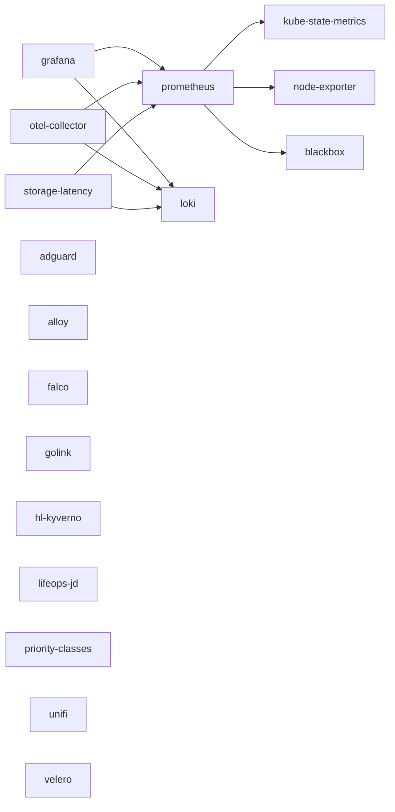

# Services

> **Status:** Stub
> **Last reviewed:** 2026-04-23
> **Owner:** @ariel-extending851

Index of every application deployed to the k3s cluster. Each row links to the canonical service doc; manifests are in [`k8s/apps/`](../../k8s/apps/) and synced via ArgoCD.

The table below is auto-generated from `k8s/apps/<app>/` by `bin/generate_service_catalog.py`. The Owner and Tier columns come from each app's `catalog-info.yaml` (see `make catalog-score` for validation rules). Run `make generate-catalog` after adding or removing an app; a pre-commit hook fails the build if the file drifts.

<!-- catalog:start -->
| App | Doc | Namespace | Ingress | Owner | Tier |
|---|---|---|---|---|---|
| AdGuard Home | [adguard.md](adguard.md) | `adguard` | <https://adguard.tail57bf10.ts.net> | @ariel-extending851 | `rpi3-only` |
| alloy | — | `alloy` | <https://alloy.tail57bf10.ts.net> | @ariel-extending851 | `any` |
| blackbox | [monitoring-stack.md](monitoring-stack.md#blackbox) | `blackbox` | — | @ariel-extending851 | `any` |
| Falco | [falco.md](falco.md) | `falco` | — | @ariel-extending851 | `any` |
| GoLink | [golink.md](golink.md) | `golink` | <https://golink.tail57bf10.ts.net> | @ariel-extending851 | `any` |
| Grafana | [grafana.md](grafana.md) | `grafana` | <https://grafana.tail57bf10.ts.net> | @ariel-extending851 | `rpi4-or-ec2` |
| hl-kyverno | — | `—` | — | @ariel-extending851 | `any` |
| kube-state-metrics | [monitoring-stack.md](monitoring-stack.md#kube-state-metrics) | `kube-state-metrics` | — | @ariel-extending851 | `any` |
| lifeops-jd | [lifeops-jd.md](lifeops-jd.md) | `lifeops-jd` | — | @ariel-extending851 | `any` |
| Loki | [loki.md](loki.md) | `loki` | <https://loki.tail57bf10.ts.net> | @ariel-extending851 | `rpi4-or-ec2` |
| node-exporter | [monitoring-stack.md](monitoring-stack.md#node-exporter) | `node-exporter` | — | @ariel-extending851 | `any` |
| otel-collector | [monitoring-stack.md](monitoring-stack.md#otel-collector) | `otel-collector` | — | @ariel-extending851 | `any` |
| priority-classes | — | `—` | — | @ariel-extending851 | `any` |
| prometheus | [monitoring-stack.md](monitoring-stack.md#prometheus) | `prometheus` | <https://prometheus.tail57bf10.ts.net> | @ariel-extending851 | `rpi4-or-ec2` |
| storage-latency | — | `storage-latency` | — | @ariel-extending851 | `any` |
| unifi | — | `unifi` | — | @ariel-extending851 | `rpi3-only` |
| Velero — Cluster Backup & Disaster Recovery | [velero.md](velero.md) | `velero` | — | @ariel-extending851 | `rpi4-or-ec2` |
<!-- catalog:end -->

## Dependency graph

Generated from `spec.dependsOn` in each `catalog-info.yaml`. GitHub renders Mermaid natively in Markdown.

<!-- graph:start -->

<!-- graph:end -->

System-only components not deployed under `k8s/apps/` (e.g. Tailscale Operator) are documented separately:

- [Tailscale Operator](tailscale-operator.md) — installed as part of the cluster bootstrap, not a Kustomize app.
